---
## Author
author:
  name: Мухина Ксения Николаевна
  email: 1032253531@rudn.ru
  affiliation:
    - name: Российский университет дружбы народов
      country: Российская Федерация
      postal-code: 117198
      city: Москва
      address: ул. Миклухо-Маклая, д. 6

## Title
title: "Отчёт №2 по прохождению курса Stepik"
subtitle: "Управление серверами"
license: "CC BY NC"
---

# Цель работы

Пройти курс на платформе Stepik "Введение в Linux". Ознакомиться с операционной системой Linux и её функциями.

# Задание

Просмотреть теоретический материал в формате видео и текста. На основе полученной информации пройти тестовые задания курса.

# Теоретическое введение

OS Linux - семейство Unix-подобных операционных систем на базе ядра Linux, включающих тот или иной набор утилит и программ проекта GNU, и, возможно, другие компоненты. Как и ядро Linux, системы на его основе создаются и распространяются в соответствии с моделью разработки свободного и открытого программного обеспечения. Linux-системы распространяются в основном бесплатно в виде различных дистрибутивов в форме, готовой для установки и удобной для сопровождения и обновлений, и имеющих свой набор системных и прикладных компонентов, как свободных, так и проприетарных.

# Выполнение курса

Следующее тестовое задание не нуждается в подробном пояснении.

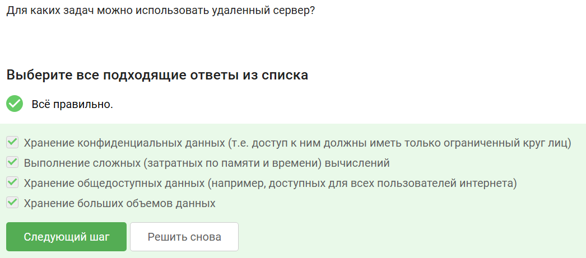{#01 width=70%}

Следующий ответ был выбран исходя из информации о ключах. id_rsa.pub является публичным ключом, а id_rsa - приватным.

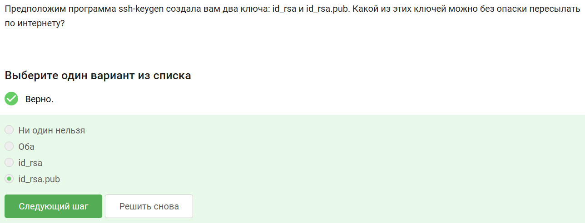{#02 width=70%}

Следующие тестовые и практические задания не нуждаются в подробном пояснении.

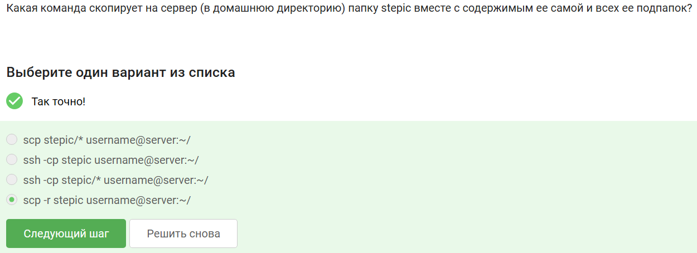{#03 width=70%}

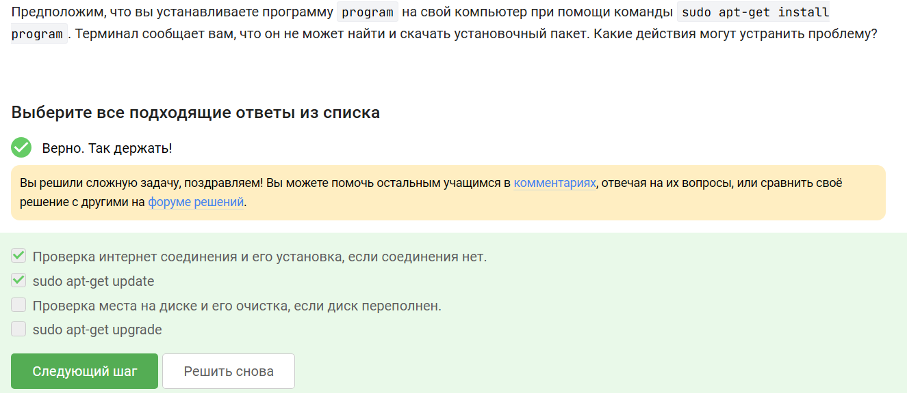{#04 width=70%}

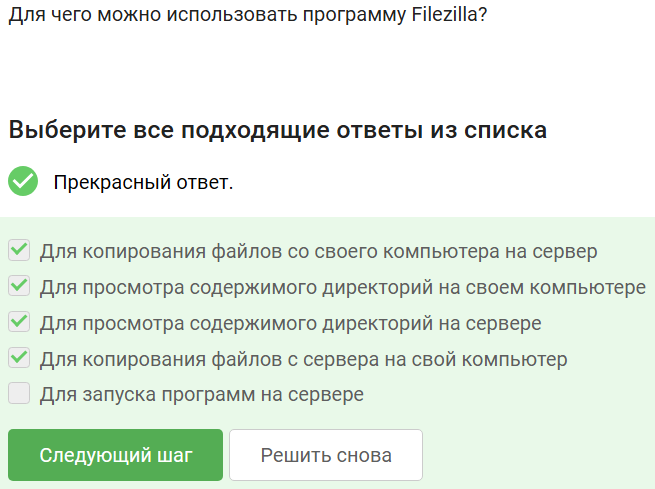{#5 width=70%}

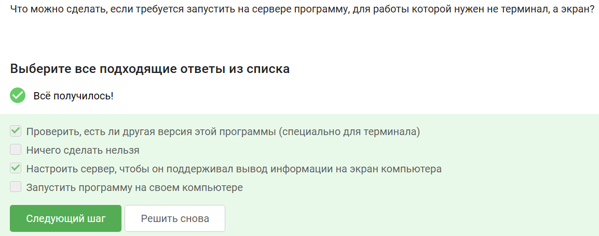{#06 width=70%}

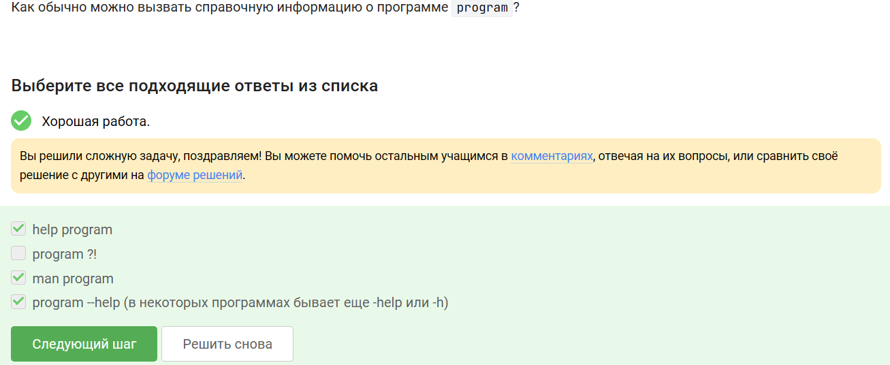{#07 width=70%}

Следующее задание касается работы FastQC и форматов данных, которые он может принимать на вход..

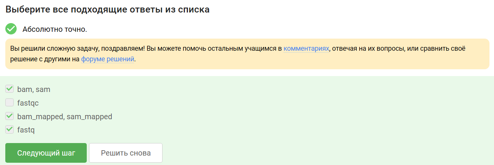{#08 width=70%}

Следующее задание касается работы Clustal. Команда была задана в соответствии с требованиями задания.

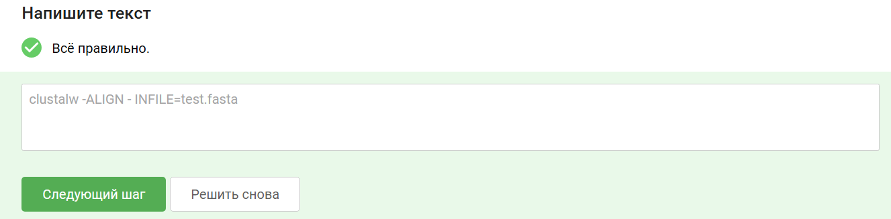{#09 width=70%}

Следующие тестовые и практические задания не нуждаются в подробном пояснении.

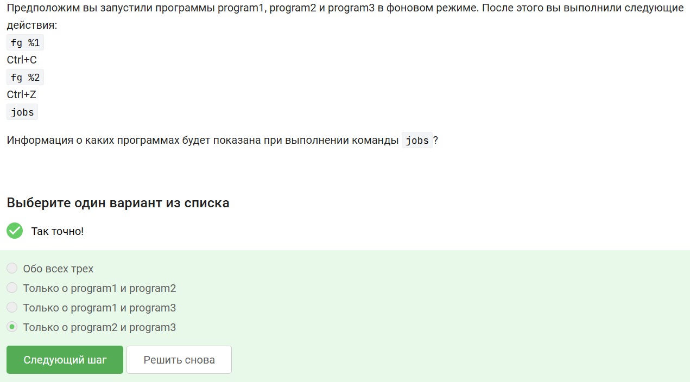{#10 width=70%}

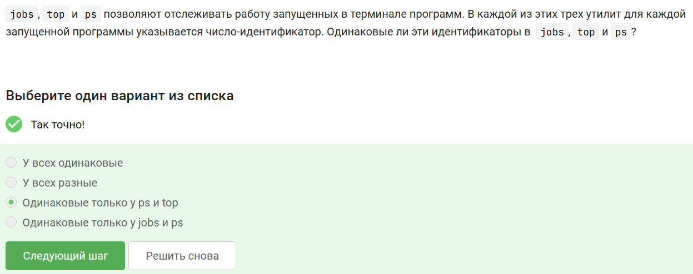{#11 width=70%}

В отличие от обычного kill, запускающего процесс завершения задания, команда 'kill -9' позволяет "убить" процесс сразу.

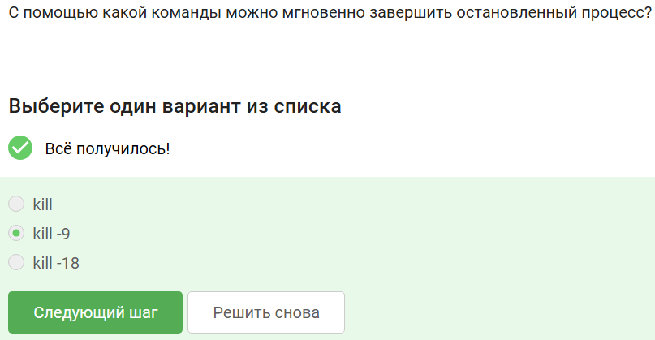{#12 width=70%}

Следующие тестовые и практические задания не нуждаются в подробном пояснении.

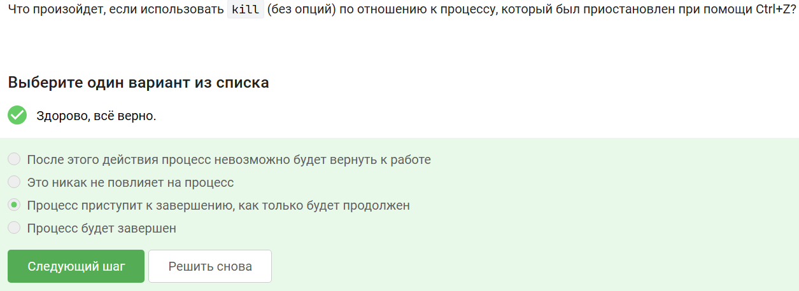{#13 width=70%}

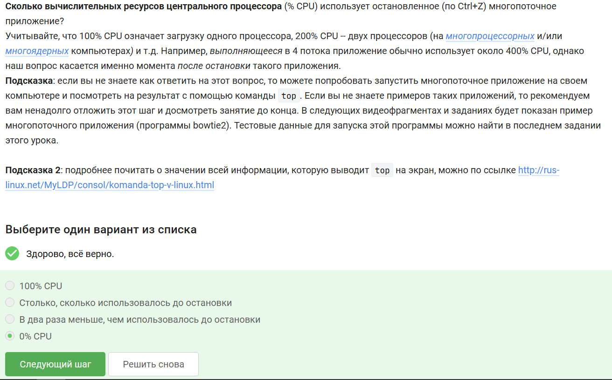{#14 width=70%}

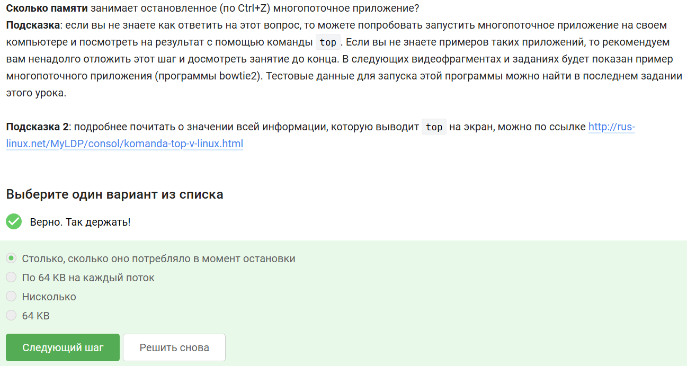{#15 width=70%}

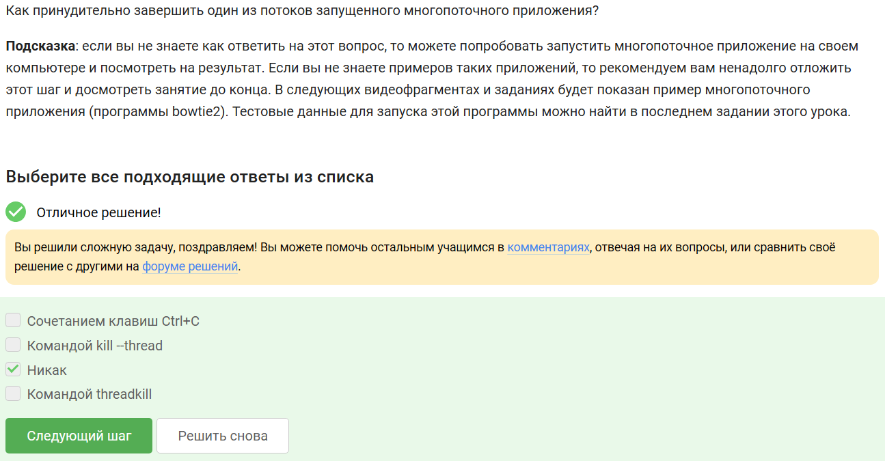{#16 width=70%}

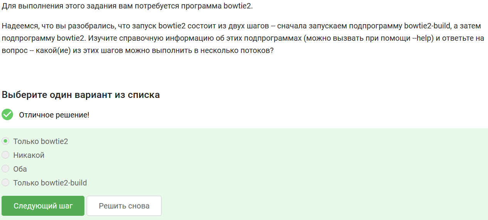{#17 width=70%}

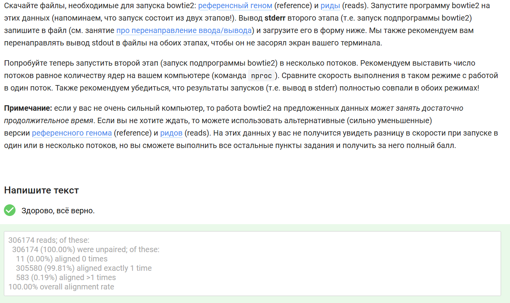{#18 width=70%}

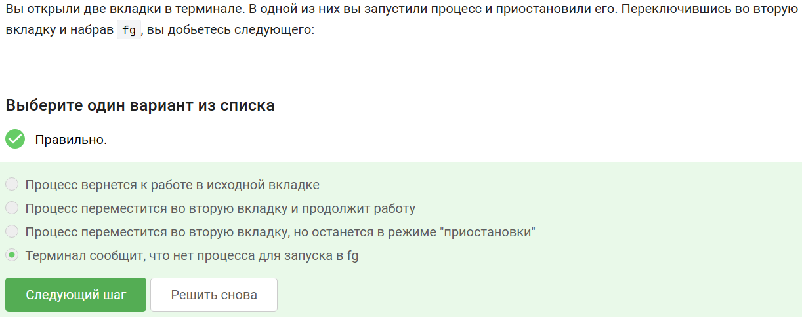{#19 width=70%}

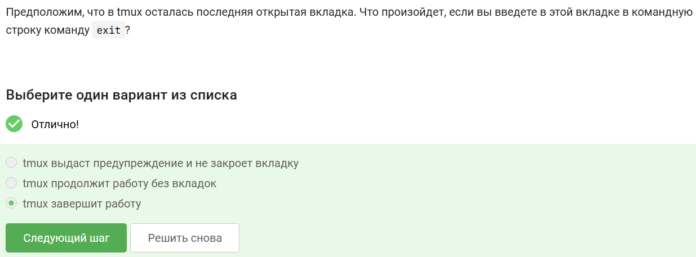{#20 width=70%}

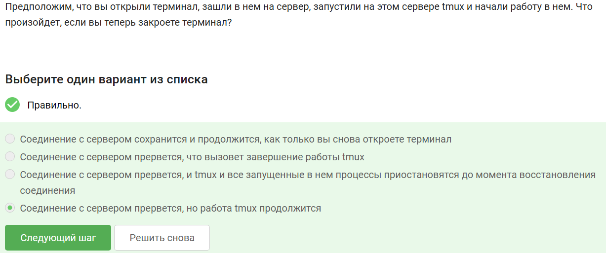{#21 width=70%}

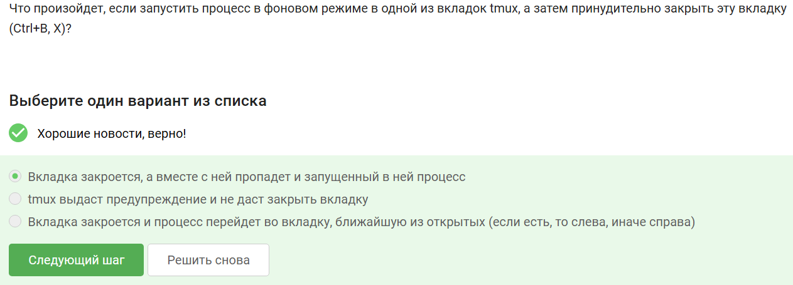{#22 width=70%}

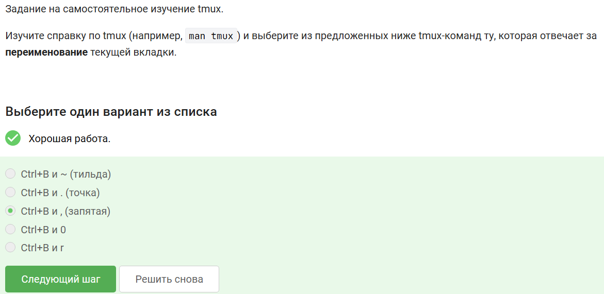{#23 width=70%}

Следующее задание касается работы со вкладками в tmux.

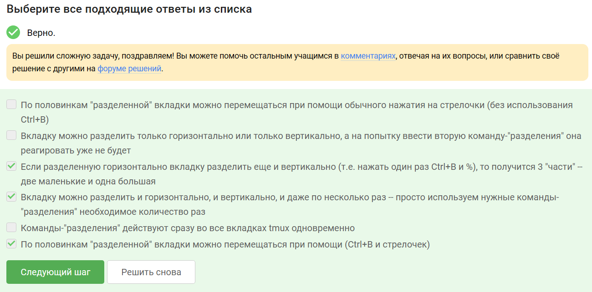{#24 width=70%}

# Выводы

В рамках данного этапа мы освоили материал 2 этапа курса и выполнили соответствующие тестовые задания.

# Список литературы{.unnumbered}

- [Курс "Введение в Linux" (Stepik)](https://stepik.org/course/73)