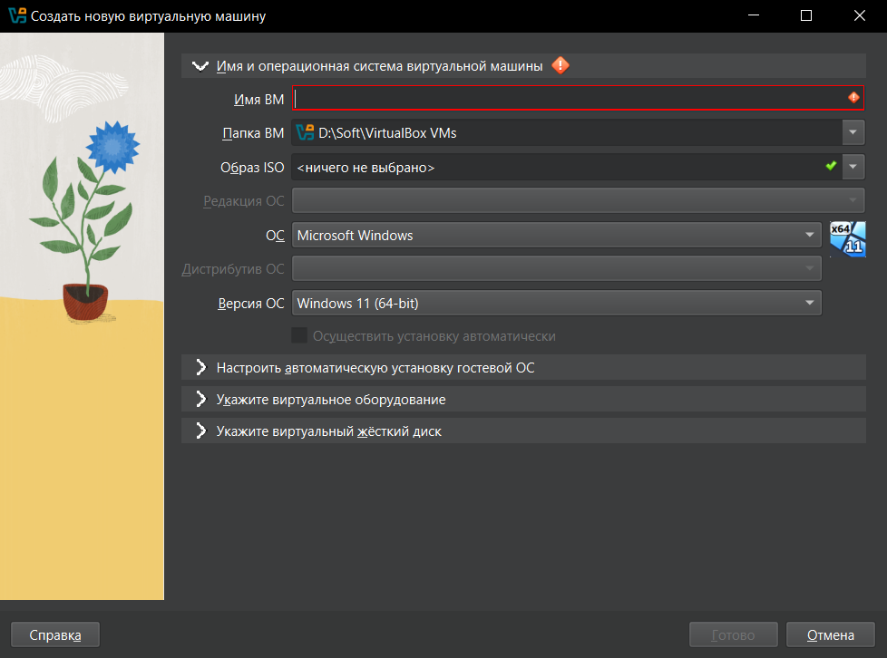

---
## Author
author:
  name: Мухина Ксения Николаевна
  email: 1032253531@pfur.ru
  affilation:
    - name: Российский университет дружбы народов
      country: Российская Федерация
      postal-code: 115419
      city: Москва
      address: ул. Орджоникидзе, д. 3
## Title
title: Лабораторная работа №1
subtitle: Установка и конфигурация операционной системы на виртуальную машину
licence: CC BY-NC
date: today
date-format: "YYYY-MM-DD" # Example: 2025-09-06
---

# Информация

## Докладчик

:::::::::::::: {.columns align=center}
::: {.column width="70%"}

  * Мухина Ксения Николаевна
  * студент 1 курса, бакалавриат
  * компьютерные и информационные науки
  * Российский университет дружбы народов им. П. Лумумбы
  * [1032253531@rudn.ru](mailto:1032253531@rudn.ru)
  * <https://github.com/knmuhina/>

:::
::: {.column width="30%"}

:::
::::::::::::::

# Вводная часть

## Актуальность

- Важно иметь навыки работы с виртуальными машинами
- Операционные системы, существующие внутри виртуальных машин, предоставляют разработчикам большое количество возможностей

## Объект и предмет исследования

- ПО для создания виртуальных машин и управления ими Oracle VirtualBox
- Операционная система Linux Fedora Sway

## Цели и задачи

- Установить Linux Fedora Sway на Oracle VirtualBox
- Выполнить базовую настройку виртуальной ОС
- Установить необходимого ПО

# Выполнение работы

## Создание виртуальной машины

- Чтобы создать виртуальную машину, требуется выполнить предварительную настройку.
- Необходимо указать: имя и ОС машины, выделяемое ОЗУ и ЦПУ, тип виртуального жёсткого диска.

## Установка ОС

- Добавив Live-образ ОС в качестве оптического диска, запускается виртуальная машина и проводится дальнейшая установка ОС

## Установка необходимого ПО

- После установки ОС виртуальная машина перезагружается. Далее выполняется установка следующего ПО через терминал:
- tmux mc, pandoc, pandoc-crossref, texlive

# Результаты

## Результаты выполнения работы

- Были приобретены практические навыки установки ОС на Oracle VirtualBox
- Была выполнена настройка необходимых для дальнейшей работы сервисов

## Контрольные вопросы

- Учётная запись пользователя содержит: имя пользователя, его ID, ID группы, домашний каталог, пароль
- Основные команды терминала: cd, ls, du, mk/mkdir, rm/rmdir, history, touch
- Файловая система позволяет хранить, организовывать файлы на носителе и управлять ими
- mount позволяет посмотреть подмонтированные в ОС файловые системы
- kill позволяет завершить зависший процесс
