---
## Author
author:
  name: Мухина Ксения Николаевна
  email: 1032253531@rudn.ru
  affiliation:
    - name: Российский университет дружбы народов
      country: Российская Федерация
      postal-code: 115419
      city: Москва
      address: ул. Орджоникидзе, д. 3

## Title
title: "Отчёт по лабораторной работе №1"
subtitle: "Дисциплина: Операционные системы"
license: "CC BY-NC"
---

# Цель работы

Цель данной работы -- приобретение практических навыков установки ОС на виртуальную машину (далее - ВМ), настройка необходимых для дальнейшей работы сервисов.

# Задание

Этапы выполнения работы:

- установка Linux Fedora Sway на ВМ
- базовая настройка виртуальной ОС
- установка необходимого ПО

# Выполнение лабораторной работы

Перед началом установки проверим настройки самого VirtualBox. Всё, что необходимо изменить на данный момент - хост-клавишу ([рис. @01]), чтобы она не конфликтовала с другими в виртуальной ОС.

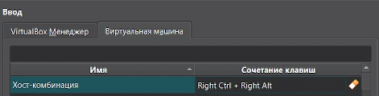{#01 width=70%}

Перейдём к созданию самой ВМ. В окне создания ВМ зададим следующие параметры:

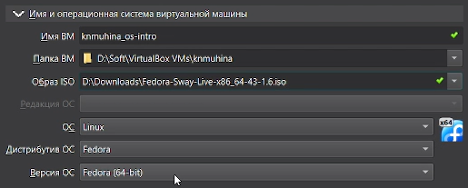{#02 width=70%}

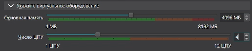{#03 width=70%}

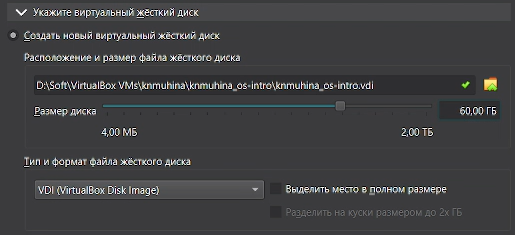{#04 width=70%}

Далее настроим ВМ в соответствии с требованиями системы выполняющего работу.

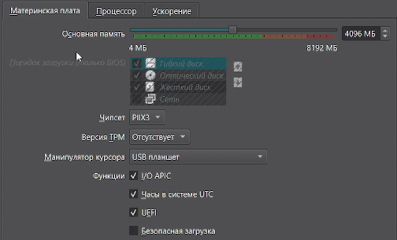{#05 width=70%}

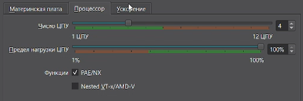{#06 width=70%}

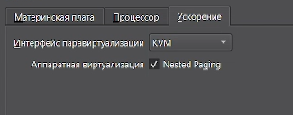{#07 width=70%}

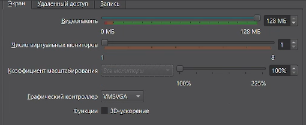{#08 width=70%}

Теперь запустим ВМ и загрузим заранее установленный LiveCD. После загрузки используем сочетание клавиш 'Win + D' для перехода к меню программ, введём liveinst и выберем его.

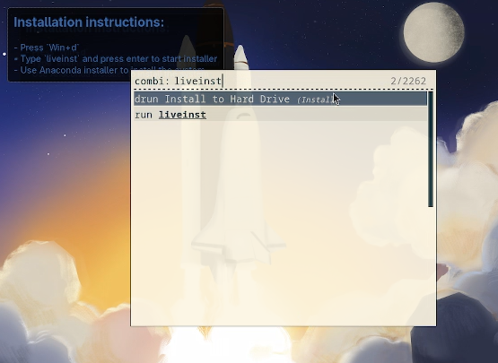{#09 width=70%}

После этого запустится установщик Anaconda ([рис. @10]), в котором далее мы зададим необходимые настройки. 

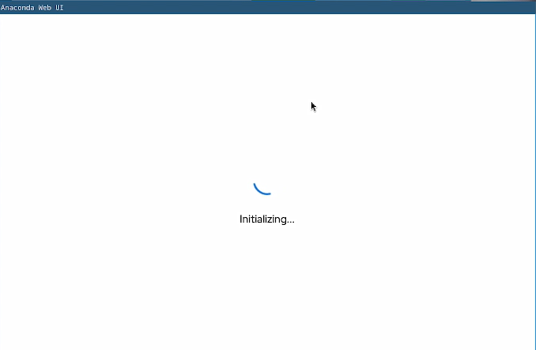{#10 width=70%}

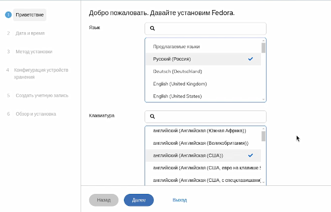{#11 width=70%}

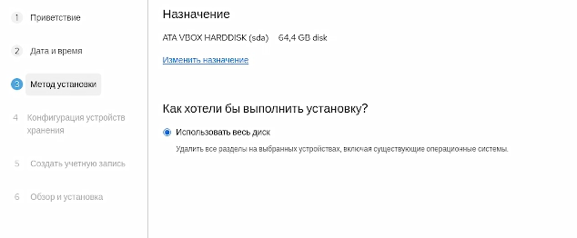{#12 width=70%}

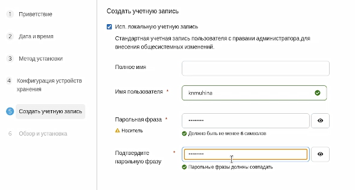{#13 width=70%}

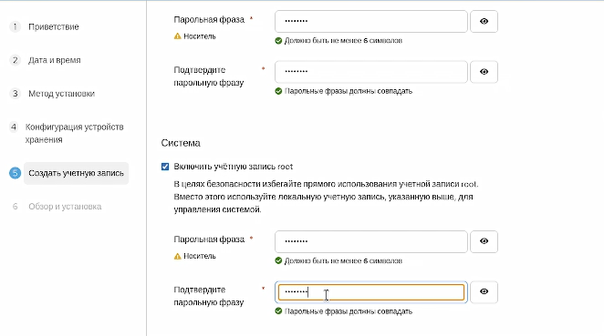{#14 width=70%}

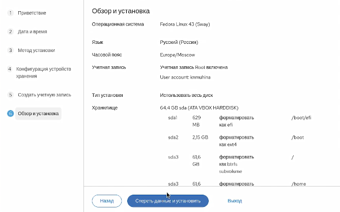{#15 width=70%}

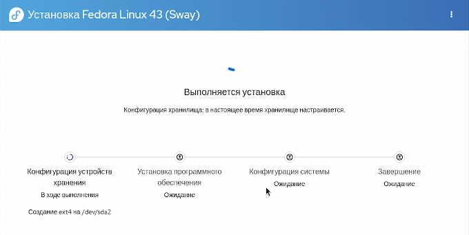{#16 width=70%}

Дождавшись окончания установки, выключим ВМ и выполним изъятие Live-образа через настройки ВМ.

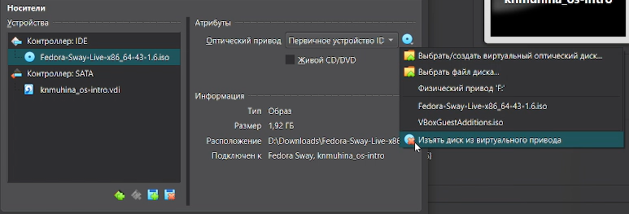{#17 width=70%}

Снова запустим ВМ, войдём в ОС и откроем терминал через 'Win + Enter'. В нём мы войдём в роль супер-пользователя через 'sudo -i' и установим средства разработки и обновим все пакеты, используя 'sudo'.

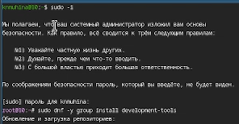{#18 width=70%}

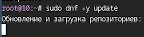{#19 width=70%}

Для повышения комфорта работы также установим tmux mc.

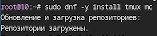{#20 width=70%}

Далее отключим SELinux. Откроем файл конфига через 'nano' ([рис. @21]) и изменим соответствующую строку.

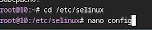{#21 width=70%}

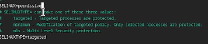{#22 width=70%}

Перезагрузим ВМ через 'sudo systemctl reboot' и приступим к настройке раскладки клавиатуры. Для начала создадим конфигурационный файл и отредактируем его.

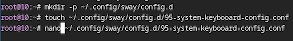{#23 width=70%}

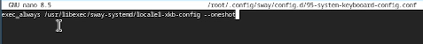{#24 width=70%}

Далее изменим конфигурационный файл в другом разделе.

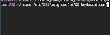{#25 width=70%}

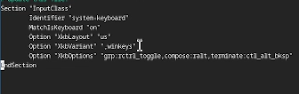{#26 width=70%}

Снова перезагрузим ВМ и перейдём к установке имени пользователя и названия хоста. Так как всё уже установлено верно [(рис. @27)], мы пропустим данный шаг.

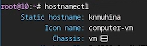{#27 width=70%}

Перейдём к установке ПО, необходимого для создания документации. Установим pandoc [(рис. @28)] и pandoc-crossref ([рис. @29]). Т.к. второе нельзя установить через 'sudo dnf', в данной работе был заранее установлен и использован 'cabal'.

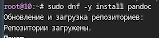{#28 width=70%}

{#29 width=70%}

Далее установим TeXLive.

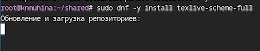{#30 width=70%}

# Дополнительное задание

Запустив ВМ и открыв терминал, мы проанализируем данные о ВМ и последовательность загрузки системы, используя 'dmesg | grep -i'.

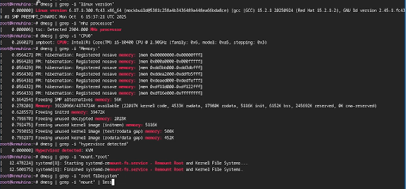{#31 width=70%}

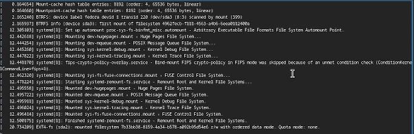{#32 width=70%}

# Выводы

В результате проделанной работы мы приобрели практические навыки установки ОС на ВМ и настройке необходимых для её дальнейшей работы сервисов.

# Контрольные вопросы

1. Какую информацию содержит учётная запись пользователя?

Учётная запись пользователя содержит:

- имя пользователя
- ID пользователя
- ID группы
- домашний каталог
- пароль (в зашифрованном виде)
- дополнительные группы

2. Укажите команды терминала и приведите примеры:

- для получения справки: <команда> --help
- для перемещения по файловой системе: cd <каталог>, cd .. (для перемещения вверх по иерархии), cd ~ (перемещение в домашний каталог)
- для просмотра содержимого каталога: ls
- для определения объёма каталога: du
- для создания/удаления каталогов/файлов: mkdir/rmdir, touch/rm
- для задания определённых прав на каталог/файл: chmod, chown (для изменения владельца)
- просмотр истории команд: history

3. Что такое файловая система? Приведите примеры с краткой характеристикой.

Файловая система - способ хранения, организации и управления файлами на носителе.

Примеры файловых систем:
- FAT32: используется на флэшках, простая и совместимая. Максимальный размер файла - 4ГБ.
- NTFS: используется в Windows, имеет поддержку прав доступа.

4. Как посмотреть, какие файловые системы подмонтированы в ОС?

При помощи команды mount.

5. Как удалить зависший процесс?.

Найти процесс через top и завершить, используя 'kill <ID>' или 'kill <название>'.

# Список литературы{.unnumbered}

1. [Лабораторная работа №1, ТУИС РУДН](https://esystem.rudn.ru/mod/page/view.php?id=1358180)
