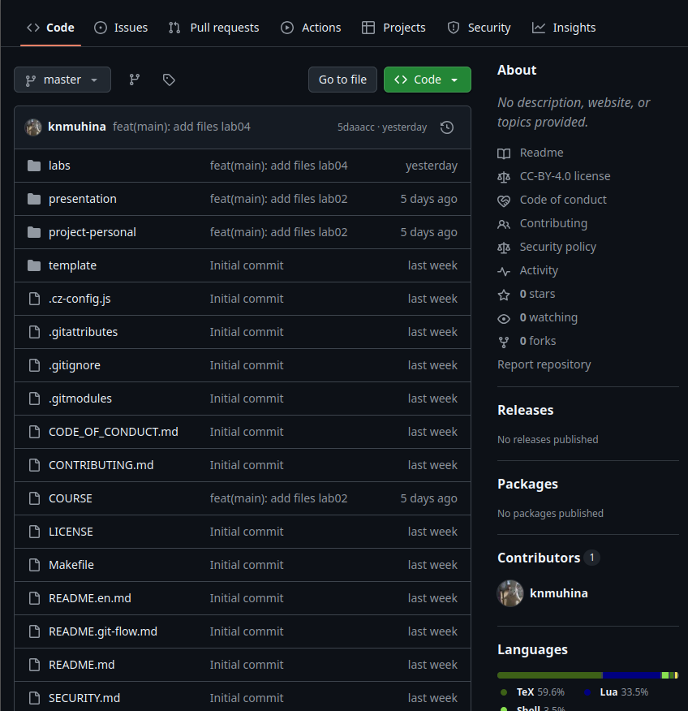

---
## Author
author:
  name: Мухина Ксения Николаевна
  email: 1032253531@pfur.ru
  affilation:
    - name: Российский университет дружбы народов
      country: Российская Федерация
      postal-code: 115419
      city: Москва
      address: ул. Орджоникидзе, д. 3
## Title
title: Первоначальная настройка git
subtitle: Лабораторная работа №2
licence: CC BY-NC
date: today
date-format: "YYYY-MM-DD" # Example: 2025-09-06
---

# Информация

## Докладчик

:::::::::::::: {.columns align=center}
::: {.column width="70%"}

  * Мухина Ксения Николаевна
  * студент 1 курса, бакалавриат
  * компьютерные и информационные науки
  * Российский университет дружбы народов им. П. Лумумбы
  * [1032253531@rudn.ru](mailto:1032253531@rudn.ru)
  * <https://github.com/knmuhina/>

:::
::: {.column width="30%"}

:::
::::::::::::::

# Вводная часть

## Актуальность

- Система контроля версий git открывает для разработчиков многие возможности во время разработки проекта

## Объект и предмет исследования

- Система контроля версий git
- Локальный репозиторий, созданный при помощи данной системы

## Цели и задачи

- Изучить идеологию и применение средств контроля версий
- Освоить умения по работе с git
- Создать локальный каталог для выполнения будущих заданий

# Теоретическое введение

## Системы контроля версий

- Применяются при работе нескольких человек над одним проектом
- Они могут обеспечивать дополнительные, более гибкие функциональные возможности
- Представляет собой набор программ командной строки. Доступ к ним можно получить из терминала

## Основные команды git

- git init
- git pull
- git push
- git status
- git add
- git commit
- git branch

# Выполнение работы

## Базовая настройка git

- Перед началом работы устанавливаются git и gh. После этого задаются такие базовые параметры в git как данные о владельце репозитория, ключи SSH и PGP
- Создаётся учётная запись на GitHub, куда добавляется PGP ключ

## Создание репозитория

- Репозиторий будет создан на основе [шаблона рабочего пространства](https://github.com/yamadharma/course-directory-student-template)
- Файлы, клонированные из шаблона, редактируются и затем отправляются на сервер
- В итоге мы получаем готовую страницу репозитория на GitHub

# Результаты

## Результаты выполнения работы

- Были приобретены базовые навыки работы с git
- Был создан репозиторий курса на GitHub

## Контрольные вопросы

- Система контроля версий хранит историю изменений файлов и позволяет отслеживать изменения, возвращаться к прошлым версиям, работать нескольким людям одновременно, вести параллельную разработку
- Различают централизованные и децентрализованные СКВ
- Основные команды git: init, clone, pull, push, add, commit, branch.
- В основные задачи, решаемые git, включены хранение версий проекта, отслеживание его изменений, параллельная разработка и т.д.
- Ветка - отдельная линия разработки. Она может быть нужна для независимой разработки новой функции и т.п.
- Для игнорирования файлов в commit создаётся файл .gitignore. В него записываются временные, системные и скомпилированные файлы
