---
## Author
author:
  name: Мухина Ксения Николаевна
  email: 1032253531@rudn.ru
  affiliation:
    - name: Российский университет дружбы народов
      country: Российская Федерация
      postal-code: 115419
      city: Москва
      address: ул. Орджоникидзе, д. 3

## Title
title: "Отчёт по лабораторной работе №2"
subtitle: "Дисциплина: Операционные системы"
license: "CC BY-NC"
---

# Цель работы

Цель данной работы -- освоить базовые навыки работы с git, создать репозиторий на GitHub.

# Задание

Этапы выполнения работы:
- создание базовой конфигурации для работы с git
- создание ключей SSH и PGP
- настройка подписи git
- регистрация на GitHub
- создание локального каталога для выполнения заданий

# Выполнение лабораторной работы

Перед началом работы установим git и gh.

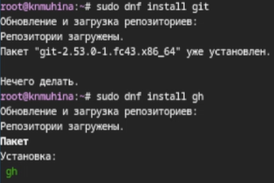{#01 width=70%}

Теперь настроим git. Заданим имя и email владельца, настроим вывод сообщений, зададим имя начальной ветки и изменим пару параметров.

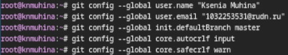{#02 width=70%}

Перейдём к созданию ключей. Ключ SSH создаётся при помощи 'ssh-keygen'. Создадим ключи по алгоритмам rsa и ed25519.

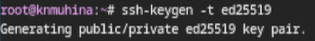{#03 width=70%}

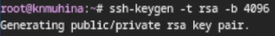{#04 width=70%}

Сгенерируем ключ PGP при помощи 'gpg'.

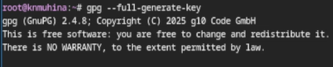{#05 width=70%} 

Далее необходимо зарегистрировать учётную запись на GitHub. Данный этап был пропущен, так как у выполняющего данную работу [уже существует страница](https://github.com/knmuhina).

Перейдём к добавлению PGP ключа в GitHub. Для начала выведем список ключей.

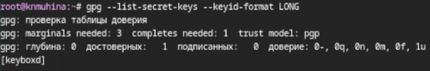{#06 width=70%} 

Скопируем ключ PGP с помощью 'gpg --armor --export <PGP Fingerprint> | xclip -sel clip'. Затем перейдём в настройки GitHub > SSH and GPG keys > New GPG key и вставим скопированный ключ.

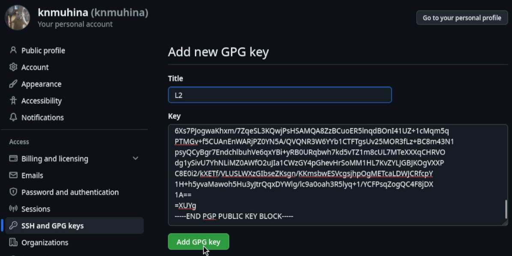{#08 width=70%} 

После добавления ключа настроим автоматические подписи коммитов. Укажем git применять наш email при подписи коммитов. После этого авторизуемся.

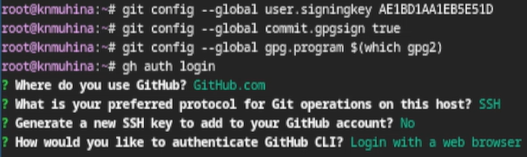{#09 width=70%}

Приступим к созданию репозитория на основе шаблона.

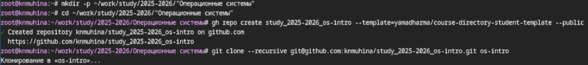{#10 width=70%}

Настроим каталог курса.

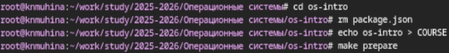{#11 width=70%} 

Отправим файлы на сервер.

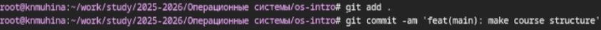{#12 width=70%} 

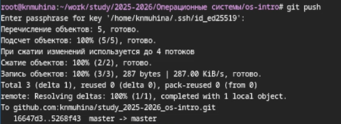{#13 width=70%} 

# Выводы

В результате проделанной работы мы освоили базовые навыки работы с git и создали репозиторий курса на GitHub.

# Список литературы{.unnumbered}

1. [Лабораторная работа №2, ТУИС РУДН](https://esystem.rudn.ru/mod/page/view.php?id=1358183)
