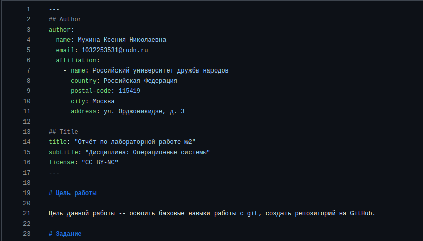

---
## Author
author:
  name: Мухина Ксения Николаевна
  email: 1032253531@pfur.ru
  affilation:
    - name: Российский университет дружбы народов
      country: Российская Федерация
      postal-code: 115419
      city: Москва
      address: ул. Орджоникидзе, д. 3
## Title
title: Язык разметки Markdown
subtitle: Лабораторная работа №3
licence: CC BY-NC
date: today
date-format: "YYYY-MM-DD" # Example: 2025-09-06
---

# Информация

## Докладчик

:::::::::::::: {.columns align=center}
::: {.column width="70%"}

  * Мухина Ксения Николаевна
  * студент 1 курса, бакалавриат
  * компьютерные и информационные науки
  * Российский университет дружбы народов им. П. Лумумбы
  * [1032253531@rudn.ru](mailto:1032253531@rudn.ru)
  * <https://github.com/knmuhina/>

:::
::: {.column width="30%"}

:::
::::::::::::::

# Вводная часть

## Актуальность

- Умение работы с Markdown упрощают процесс составления отчётов по работам
- Также умение является необходимым для работы над научно-исследовательскими проектами

## Объект и предмет исследования

- Язык разметки Markdown
- Отчёт по научно-исследовательской работе

## Цели и задачи

- Приобрести навыки оформления отчётов с помощью языка разметки Markdown
- В качестве примера оформить отчёт по предыдущей лабораторной работе

# Теоретическое введение

## Базовые сведения о Markdown

- Файлы Markdown могут использовать форматы md и qmd
- Форматирование текста:
- "#" используется для создания заголовка
- "*" используется для различных начертаний текста
- ">" позволяет создать блок цитирования
- "-" позволяет отформатировать список

## Обработка файлов

- Для обработки файлов может быть использован pandoc
- Также может быть использован quarto

## Структура отчёта

- титульный лист
- реферат
- введение
- основная часть
- заключение

# Выполнение работы

## Составление отчёта

- В качестве примера был оформлен отчёт по лабораторной работе №2. Отчёт загружен на GitHub

# Результаты

## Результаты выполнения работы

- Были приобретены практические навыки установки ОС на Oracle VirtualBox
- Была выполнена настройка необходимых для дальнейшей работы сервисов
