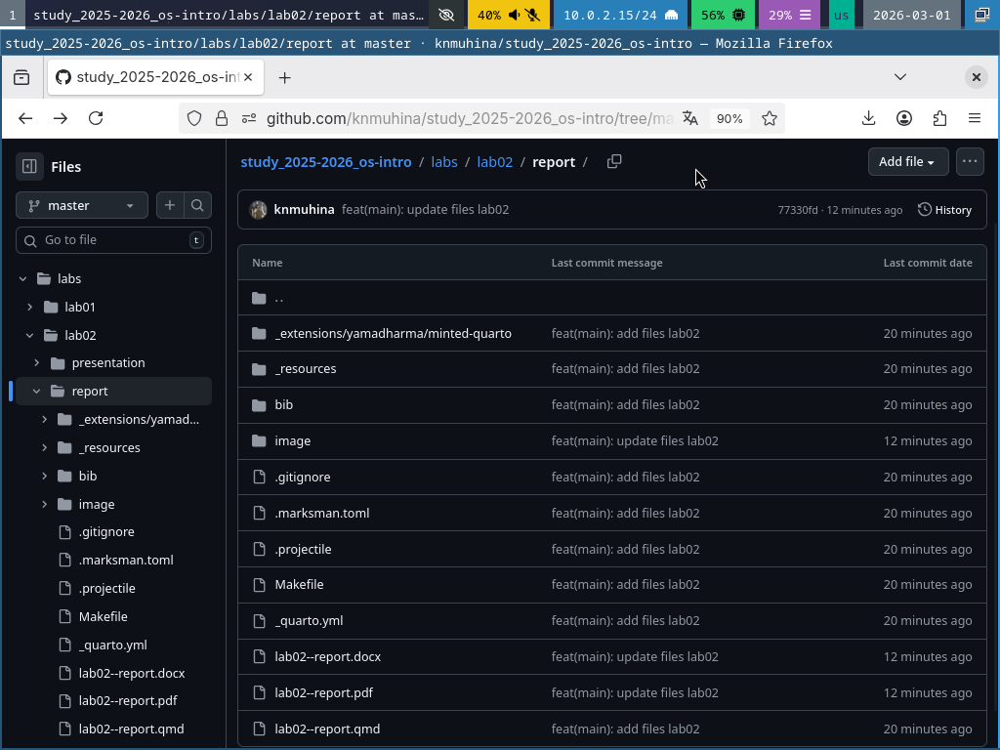

---
## Author
author:
  name: Мухина Ксения Николаевна
  email: 1032253531@rudn.ru
  affiliation:
    - name: Российский университет дружбы народов
      country: Российская Федерация
      postal-code: 115419
      city: Москва
      address: ул. Орджоникидзе, д. 3

## Title
title: "Отчёт по лабораторной работе №3"
subtitle: "Дисциплина: Операционные системы"
license: "CC BY-NC"
---

# Цель работы

Цель данной работы -- научиться оформлять отчёты с помощью языка разметки Markdown.

# Задание

Этапы выполнения работы:

- составление отчёта
- загрузка на GitHub

# Выполнение лабораторной работы

В соответствии с заданиями лабораторной работы был составлен отчёт по работе №2 и загружен на GitHub.

{#01 width=70%}

# Выводы

В результате проделанной работы мы научились оформлять отчёты с помощью языка разметки Markdown и составили отчёт для лабораторной работы №2.

# Список литературы{.unnumbered}

1. [Лабораторная работа №3, ТУИС РУДН](https://esystem.rudn.ru/mod/page/view.php?id=1358185)
