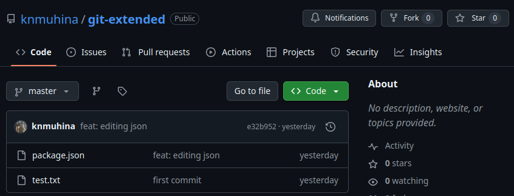
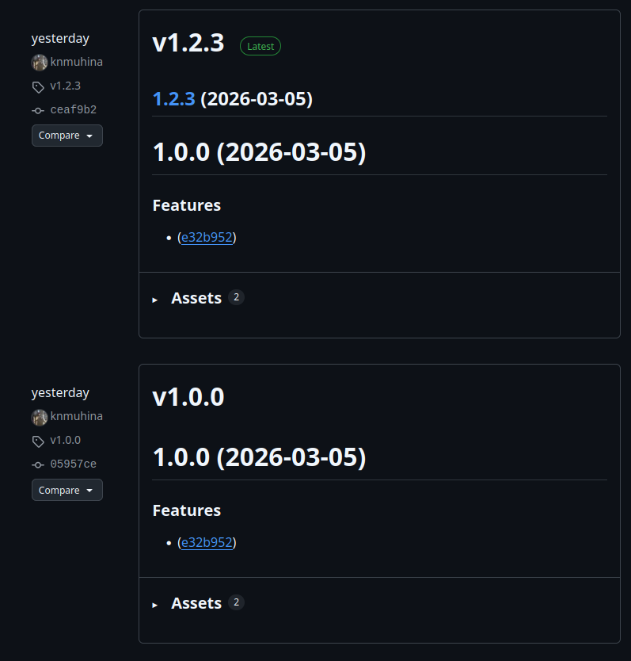

---
## Author
author:
  name: Мухина Ксения Николаевна
  email: 1032253531@pfur.ru
  affilation:
    - name: Российский университет дружбы народов
      country: Российская Федерация
      postal-code: 115419
      city: Москва
      address: ул. Орджоникидзе, д. 3
## Title
title: Продвинутое использование git
subtitle: Лабораторная работа №4
licence: CC BY-NC
date: today
date-format: "YYYY-MM-DD" # Example: 2025-09-06
---

# Информация

## Докладчик

:::::::::::::: {.columns align=center}
::: {.column width="70%"}

  * Мухина Ксения Николаевна
  * студент 1 курса, бакалавриат
  * компьютерные и информационные науки
  * Российский университет дружбы народов им. П. Лумумбы
  * [1032253531@rudn.ru](mailto:1032253531@rudn.ru)
  * <https://github.com/knmuhina/>

:::
::: {.column width="30%"}

:::
::::::::::::::

# Вводная часть

## Актуальность

- Система контроля версий git открывает для разработчиков многие возможности во время разработки проекта

## Объект и предмет исследования

- Система контроля версий git
- Локальный репозиторий, созданный при помощи данной системы

## Цели и задачи

- Освоить умения по продвинутой работе с git
- Создать локальный репозиторий с тестовыми релизами

# Теоретическое введение

## Рабочий процесс Gitflow

- Данная модель отлично подходит для организации рабочего процесса на основе релизов
- Работа по модели Gitflow подразумевает работу с различными ветками, включая основные, функциональные, ветки разработки, выпуска и т.д.
- Работа по модели Gitflow включает создание отдельной ветки для исправлений ошибок в рабочей среде

## Типы коммитов

- fix:
- feat:
- BREAKING CHANGE:
- revert:

# Выполнение работы

## Установка программного обеспечения

- Перед работой проводится установка gitflow, nodejs и pnpm
- Далее при помощи pnpm создаются commitizen и standard-changelog для помощи в формировании коммитов и в создании логов соответственно

## Создание репозитория git

- Создаётся репозиторий на GitHub с названием git-extended и отправляется на сервер. Далее производится конфигурация общепринятых коммитов

## Конфигурация Gitflow и работа с репозиторием

::::::::::::::{.columns align=center}
::: {.column width="70%"}

- Проводятся настройки по установлении иерархии веток origin и develop и создаётся релиз с версией 1.0.0
- Далее создаётся ветка для новой функциональности feature_branch, в которой проводится обычная работа с git. После этого ветка объединяется с develop
- Создаётся релиз с версией 1.2.3

:::
::: {.column width="30%"}

:::
::::::::::::::

# Результаты

## Результаты выполнения работы

- Были приобретены навыки продвинутой работы с git
- Был создан репозиторий с тестовыми релизами на GitHub
