---
## Author
author:
  name: Мухина Ксения Николаевна
  email: 1032253531@rudn.ru
  affiliation:
    - name: Российский университет дружбы народов
      country: Российская Федерация
      postal-code: 115419
      city: Москва
      address: ул. Орджоникидзе, д. 3

## Title
title: "Отчёт по лабораторной работе №4"
subtitle: "Дисциплина: Операционные системы"
license: "CC BY-NC"
---

# Цель работы

Цель данной работы -- получение навыков правильной работы с репозиториями git.

# Задание

Этапы выполнения работы:

- установка необходимого ПО
- создание репозитория git
- работа с репозиторием git

# Выполнение лабораторной работы

Перед началом работы установим необходимое ПО. Для начала установим gitflow.

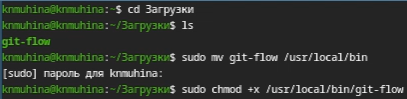{#01 width=70%}

Метод установки был изменён в связи с проблемами соединения при выполнении через командную строку.

Далее установим Node.js.

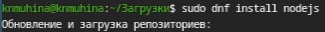{#02 width=70%}

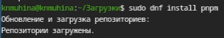{#03 width=70%}

Настроим Node.js, запустив следующие команды:

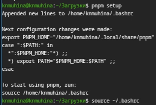{#04 width=70%}

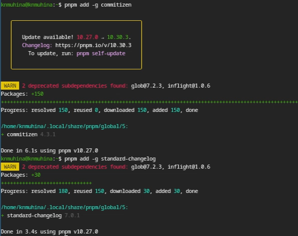{#05 width=70%}

Теперь создадим локальный репозиторий, сделаем первый коммит и выложим на GitHub.

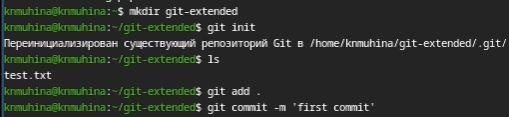{#06 width=70%}

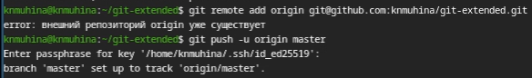{#07 width=70%}

Приступим к конфигурации общепринятых коммитов. Для начала отредактируем конфиг.

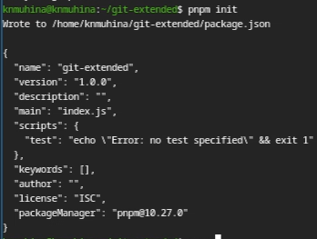{#08 width=70%}

Добавим команду для формирования коммитов.

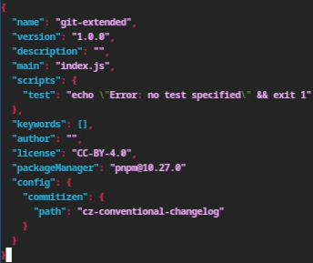{#09 width=70%}

Добавим новые файлы и выполним коммит.

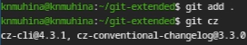{#10 width=70%}

Отправим на сервер.

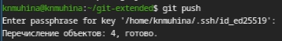{#11 width=70%}

Перейдём к конфигурации gitflow. Инициализируем gitflow.

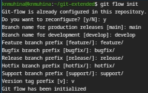{#12 width=70%}

Проверим, что мы на ветке develop.

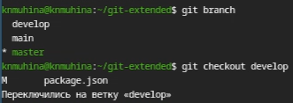{#13 width=70%}

Загрузим репозиторий в хранилище и установим внешнюю ветку как вышестояющую для текущей.

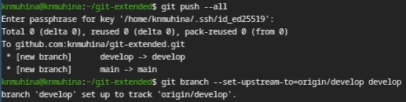{#14 width=70%}

Создадим первый релиз v1.0.0. Создадим журнал изменений, добавим его в индекс и зальём релизную ветку в основную.

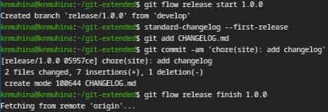{#15 width=70%}

Отправим данные на сервер и создадим релиз на GitHub.

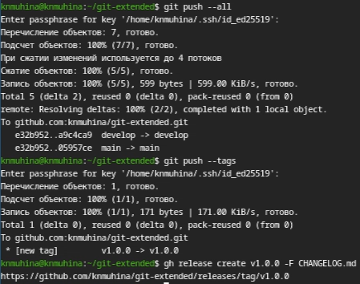{#15 width=70%}

Создадим ветку для новой функциональности.

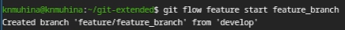{#15 width=70%}

За окончанием разработки новой функциональности следует объединение ветки с develop.

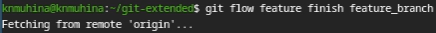{#15 width=70%}

Далее создаём релиз v1.2.3 по прежней схеме. При этом изменим в package.json версию с 1.0.0 на 1.2.3.

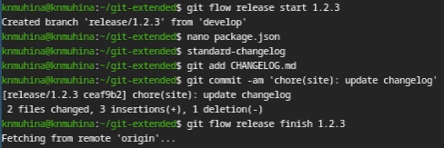{#15 width=70%}

Отправим данные на сервер и создадим релиз на GitHub.

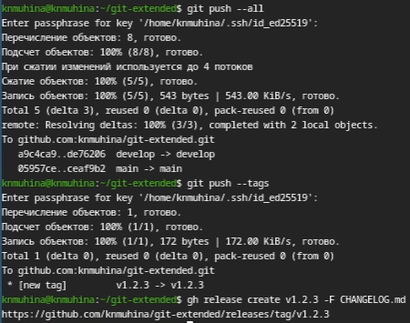{#15 width=70%}

# Выводы

В результате проделанной работы мы приобрели практические навыки работы с репозиториями git, создав два тестовых релиза.

# Список литературы{.unnumbered}

1. [Лабораторная работа №4, ТУИС РУДН](https://esystem.rudn.ru/mod/page/view.php?id=1358187)
