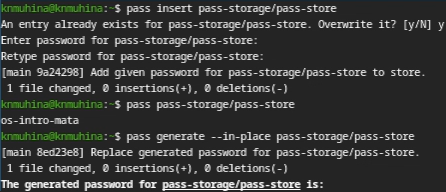
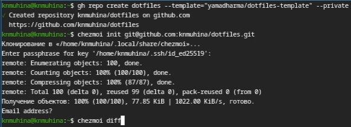
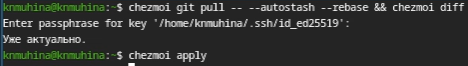
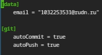

---
## Author
author:
  name: Мухина Ксения Николаевна
  email: 1032253531@pfur.ru
  affilation:
    - name: Российский университет дружбы народов
      country: Российская Федерация
      postal-code: 115419
      city: Москва
      address: ул. Орджоникидзе, д. 3
## Title
title: Настройка рабочей среды
subtitle: Лабораторная работа №5
licence: CC BY-NC
date: today
date-format: "YYYY-MM-DD" # Example: 2025-09-06
---

# Информация

## Докладчик

:::::::::::::: {.columns align=center}
::: {.column width="70%"}

  * Мухина Ксения Николаевна
  * студент 1 курса, бакалавриат
  * компьютерные и информационные науки
  * Российский университет дружбы народов им. П. Лумумбы
  * [1032253531@rudn.ru](mailto:1032253531@rudn.ru)
  * <https://github.com/knmuhina/>

:::
::: {.column width="30%"}

:::
::::::::::::::

# Вводная часть

## Актуальность

- Менеджер паролей pass позволяет хранить пароли в зашифрованных файлах и каталогах
- chezmoi позволяет управлять файлами конфигурации домашнего каталога

## Объект и предмет исследования

- Программное обеспечение pass и chezmoi
- Локальный репозиторий, настроенный при помощи chezmoi

## Цели и задачи

- Выполнить настройку рабочей среды
- Установить и настроить менеджер паролей pass
- Установить chezmoi и выполнить конфигурацию репозитория с его использованием

# Теоретическое введение

## Менеджер паролей pass

- Данные хранятся в файловой системе в виде каталогов и файлов
- Файлы шифруются с помощью GPG-ключа
- Реализации: pass, gopass
- Также имеет графические интерфейсы, приложения для Android и пакеты для Emacs

## Управление файлами конфигурации

- chezmoi используется для управления файлами конфигурации домашнего каталога пользователя
- Состояние файлов конфигурации сохраняется в каталоге ~/.local/share/chezmoi
- При выполнении chezmoi init может автоматически создать файл конфигурации, если он ещё не существует

## Шаблоны

- Полный список переменных шаблона: chezmoi data
- Источники переменных: файлы .chezmoi, файлы конфигурации .chezmoidata.$FORMAT, раздел data конфигурационного файла

## Способы создания файла шаблона

- При первом добавлении файла: chezmoi add --template ~/.zshrc
- Если файл уже контролируется chezmoi, но не является шаблоном: chezmoi chattr +template ~/.zshrc
- Можно создать шаблон вручную в исходном каталоге, присвоив расширение .tmpl

## Редактирование и тестирование шаблонов

- Редактирование файла шаблона: chezmoi edit
- Тестирование шаблона: chezmoi execute-template

# Выполнение работы

## Установка программного обеспечения

- Перед работой проводится установка pass и gopass
- Далее при помощи pass создаётся структура git и синхронизируется

{#01 width=70%}

## Установка native messaging

- Для взаимодействия с браузером используется утилита native messaging
- Перед её установкой необходимо сначала установить [расширение Browserpass](https://addons.mozilla.org/en-US/firefox/addon/browserpass-ce/), затем уже приступить к установке самой утилиты

{#02 width=70%}

## Добавление пароля

- Пароль добавляется также при помощи pass

{#03 width=70%}

## Файлы конфигурации

::::::::::::::{.columns align=center}
::: {.column width="70%"}

- Проводится установка дополнительного ПО и шрифты Iosevka. Затем проводится установка chezmoi, используя wget

:::
::: {.column width="30%"}

{#04 width=70%}

:::
::::::::::::::

## Создание и конфигурация репозитория git

- Создаётся репозиторий на GitHub с названием dotfiles и клонируется при помощи chezmoi
- chezmoi diff позволяет проверить вносимые изменения, а chezmoi apply - применять их
- Также можно сразу установить свои dotfiles командой chezmoi init --apply

{#05 width=70%}

## Команды chezmoi

- Команда chezmoi update позволяет извлечь изменения и сразу применить их
- Следующие команды позволяют извлечь изменения из репозитория и посмотреть их, фактически не применяя сами изменения

{#06 width=70%}

## Фиксирование изменений в репозитории

- Также можно настроить автоматическое фиксирование и отправление изменений в исходный каталог в репозиторий

{#07 width=70%}

# Результаты

## Результаты выполнения работы

- Были приобретены навыки работы с pass и chezmoi
- Был создан и настроен репозиторий на GitHub
