---
## Author
author:
  name: Мухина Ксения Николаевна
  email: 1032253531@rudn.ru
  affiliation:
    - name: Российский университет дружбы народов
      country: Российская Федерация
      postal-code: 115419
      city: Москва
      address: ул. Орджоникидзе, д. 3

## Title
title: "Отчёт по лабораторной работе №5"
subtitle: "Дисциплина: Операционные системы"
license: "CC BY-NC"
---

# Цель работы

Цель данной работы -- настроить рабочую среду с использованием ПО pass и chezmoi.

# Задание

Этапы выполнения работы:

- установка необходимого ПО
- настройка менеджера паролей pass
- установка и конфигурация репозитория на различных машинах при помощи chezmoi

# Выполнение лабораторной работы

Перед началом работы установим необходимое ПО. Установим pass и gopass.

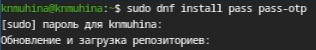{#01 width=70%}

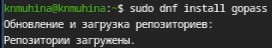{#02 width=70%}

Настроим pass. Инициализируем хранилище и создадим структуру git.

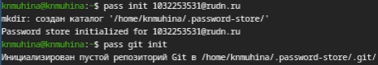{#03 width=70%}

Далее зададим адрес репозитория на хостинге и синхронизируем.

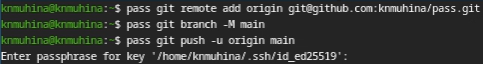{#04 width=70%}

Настроим интерфейс native messaging. Для начала установим плагин [Browserpass](https://addons.mozilla.org/en-US/firefox/addon/browserpass-ce/).

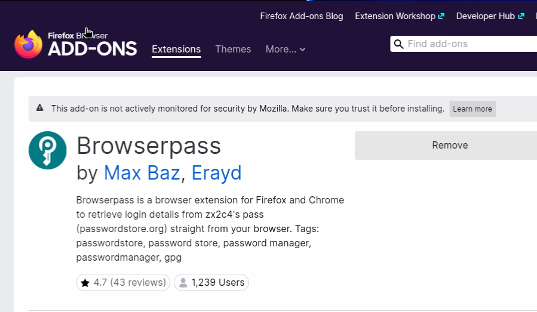{#05 width=70%}

Теперь установим native messaging.

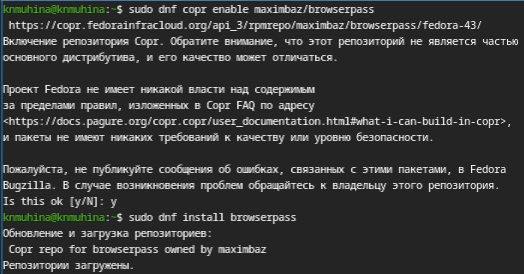{#06 width=70%}

После этого перейдём к добавлению пароля. После добавления пароля отобразим его для указанного файла и затем заменим.

{#07 width=70%}

Приступим к управлению файлами конфигурации. Установим дополнительное ПО и шрифты.

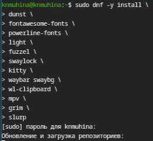{#08 width=70%}

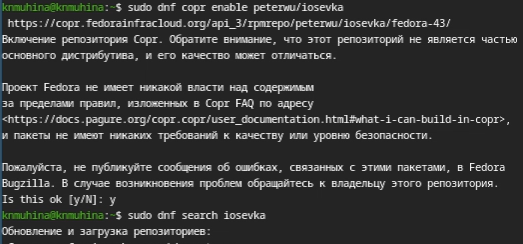{#09 width=70%}

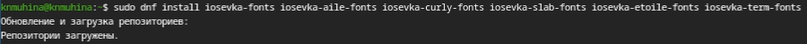{#10 width=70%}

Далее перейдём к установке и использованию сhezmoi. Для начала установим его.

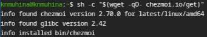{#11 width=70%}

Создадим репозиторий на основе шаблона и подключим его к своей системе. После этого проверим, какие изменения он внесёт в домашний каталог при помощи 'chezmoi diff'.

{#13 width=70%}

Применим внесённые изменения.

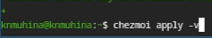{#13 width=70%}

Далее приступим к настройке новой виртуальной машины. Машина была заранее подготовлена, и на ней также была выполнена инициализация репозитория в соответствии с последними шагами.

Можно установить свои dotfiles, используя данную команду:

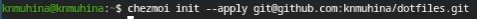{#14 width=70%}

Также можно извлечь изменения и применить их одной командой:

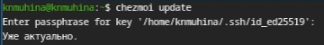{#15 width=70%}

Так как изменений никаких не приводилось, установленная версия является актуальной.

Следующие команды позволяют извлечь изменения из своего репозитория и посмотреть их, фактически не применяя:

{#16 width=70%}

Также можно настроить автоматическое фиксирование и отправление изменений в исходный каталог в репозиторий. Для этого надо добавить в файл конфигурации '~/.config/chezmoi/chezmoi.totl' следующее:

{#17 width=70%}

Однако в данном случае следует помнить, что будут фиксироваться все изменения - в том числе и "секреты", которые тоже могут быть отправлены в публичный репозиторий.

# Выводы

В результате проделанной работы мы успешно настроили рабочую среду с использованием ПО pass и chezmoi.

# Список литературы{.unnumbered}

1. [Лабораторная работа №5, ТУИС РУДН](https://esystem.rudn.ru/mod/page/view.php?id=1358189)
