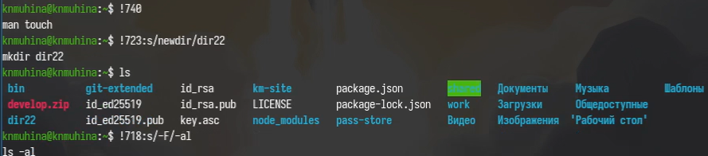

---
## Author
author:
  name: Мухина Ксения Николаевна
  email: 1032253531@pfur.ru
  affilation:
    - name: Российский университет дружбы народов
      country: Российская Федерация
      postal-code: 115419
      city: Москва
      address: ул. Орджоникидзе, д. 3
## Title
title: Основы интерфейса взаимодействия с системой Unix на уровне командной строки
subtitle: Лабораторная работа №6
licence: CC BY-NC
date: today
date-format: "YYYY-MM-DD" # Example: 2025-09-06
---

# Информация

## Докладчик

:::::::::::::: {.columns align=center}
::: {.column width="70%"}

  * Мухина Ксения Николаевна
  * студент 1 курса, бакалавриат
  * компьютерные и информационные науки
  * Российский университет дружбы народов им. П. Лумумбы
  * [1032253531@rudn.ru](mailto:1032253531@rudn.ru)
  * <https://github.com/knmuhina/>

:::
::: {.column width="30%"}

:::
::::::::::::::

# Вводная часть

## Актуальность

- Умение работать с командной строкой необходимо для работы в системах без полноценной графической оболочки.

## Объект и предмет исследования

- командная строка и её команды

## Цели и задачи

- Приобрести практические навыки взаимодействия с системой посредством командной строки
- определение домашнего каталога выполняющего
- выполнение заданий относительно данного каталога:
	- перемещение по файловой системе
	- создание и удаление каталогов 
- работа с командой man
- работа с командой history

# Теоретическое введение

## Командная строка

- Командная строка позволяет взаиамодействовать с ОС через ввод текстовых команд
- Основные команды: cd, ls, mkdir, rm/rmdir, man

# Выполнение работы

## Работа с командами pwd, cd и ls

- Перед началом работы определяется полное имя домашнего каталога посредством pwd
- Далее проводится работа с различными опциями команд cd и ls

{#01 width=70%}

## Работа с командами mkdir и rmdir

- Проводится работа с различными опциями команд mkdir и rmdir.

{#02 width=70%}

## Работа с командами man и history

- Проводится работа с различными опциями команд man и history

{#03 width=70%}

# Результаты

## Результаты выполнения работы

- Были навыки взаимодействия с системой посредством командной строки.

## Контрольные вопросы

- Командная строка - способ взаиамодействия с ОС через ввод текстовых команд с клавиатуры
- Символы экранирования - специальные символы, которые помогают вставлять служебные символы в текст или задавать специальные действия
- Относительный путь к файлу - путь, который указывается от текущей рабочей папки, а не от корня диска
- Абсолютный путь - полный путь от корня файловой системы
- Клавиша Tab служит для автоматического дополнения вводимых команд