---
## Author
author:
  name: Мухина Ксения Николаевна
  email: 1032253531@rudn.ru
  affiliation:
    - name: Российский университет дружбы народов
      country: Российская Федерация
      postal-code: 115419
      city: Москва
      address: ул. Орджоникидзе, д. 3

## Title
title: "Отчёт по лабораторной работе №6"
subtitle: "Дисциплина: Операционные системы"
license: "CC BY-NC"
---

# Цель работы

Цель данной работы -- приобрести практические навыки взаимодействия с системой посредством командной строки.

# Задание

Этапы выполнения работы:

- определение домашнего каталога выполняющего
- выполнение заданий относительно данного каталога:
	- перемещение по файловой системе,
	- создание и удаление каталогов 
- работа с командой man
- работа с командой history

# Выполнение лабораторной работы

Перед началом работы определим полное имя домашнего каталога, используя pwd.

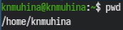{#01 width=70%}

Теперь перейдём в каталог /tmp и выведем его содержимое при помощи ls.

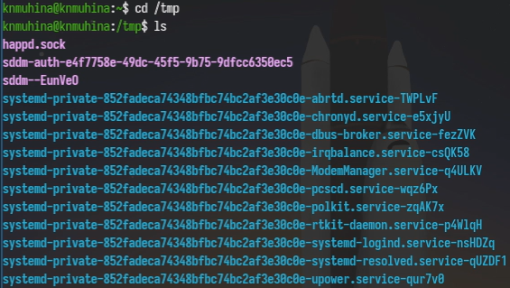{#02 width=70%}

Различные опции позволяют увидеть различную информацию о содержимом каталога. -a позволяет увидеть все файлы, включая скрытые; -F позволяет увидеть типы файлов каталога; -l позволяет увидеть подробную информацию о файлах внутри каталога.

Теперь посмотрим, существует ли в каталоге /var/spool подкаталог cron. Для этого снова воспользуемся ls.

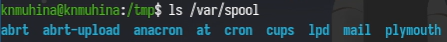{#03 width=70%}

Как мы видим, каталог есть.

Перейдём в домашний каталог при помощи cd и выведем содержимое через ls с опцией -l.

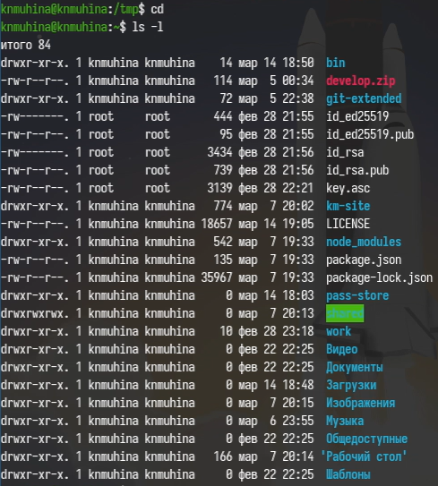{#04 width=70%}

Владельцами файлов и подкаталогов являются пользователь, то есть выполняющий работу, и суперпользователь root.

Перейдём к соданию и удалению каталогов.

Создадим каталог ~/newdir и создадим в нём подкаталог morefun.

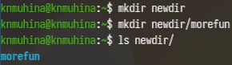{#05 width=70%} 

Далее в каталоге ~ создадим одной командой каталоги letters, memos, misk. Затем также одной командой удалим их.

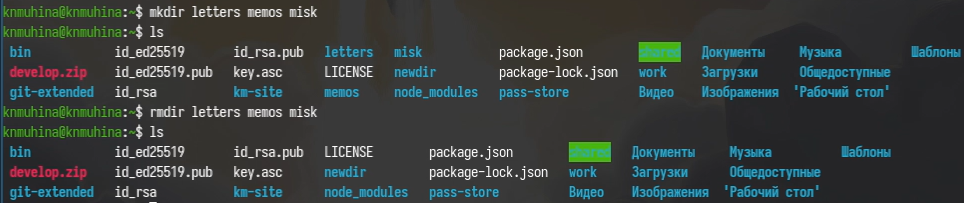{#06 width=70%} 

Попробуем удалить каталог ~/newdir при помощи rm.

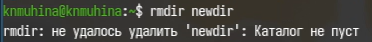{#07 width=70%} 

Как мы видим, он не был удалён, так как каталог не пустой. Необходимо либо удалить через опцию -r, либо отдельно удалить подкаталог. Выберем вторую опцию и удалим сначала morefun, затем newdir.

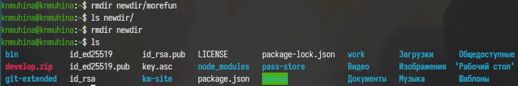{#08 width=70%}

Мы успешно удалили каталог newdir и его подкаталог morefun.

Перейдём к команде man, которая поможет посмотреть руководство по некоторым командам.

Для начала с её помощью определим, какую опцию в команде ls нужно использовать для просмотра информации о всех файлах, содержащихся в исходном каталоге и его подкаталогах.

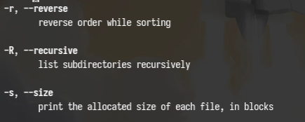{#09 width=70%}

Данной опцией является -R.

Теперь определим набор опций, позволяющий отсортировать по времени последнего изменения список содержимого с развёрнутым описанием файлов.

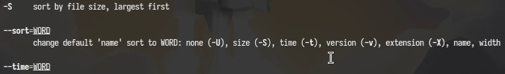{#10 width=70%} 

Необходимыми опциями являются -tl.

Используем man для просмотра описания некоторых других команд.

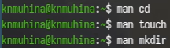{#11 width=70%} 

Перейдём к команде history, которая позволяет посмотреть историю команд. Выполним модификацию и исполнение нескольких команд.

{#12 width=70%} 

# Выводы

В результате проделанной работы мы приобрели навыки взаимодействия с системой посредством командной строки.

# Контрольные вопросы

1. Что такое командная строка?

Командная строка - способ управления компьютером через ввод текстовых команд с клавиатуры.

2. При помощи какой команды можно определить абсолютный путь текущего каталога?

При помощи pwd.

3. При помощи какой команды и каких опций можно определить только тип файлов и их имена в текущем каталоге?

При помощи команды ls -F.

4. Каким образом отобразить информацию о скрытых файлах?

При помощи команды ls -al.

5. При помощи каких команд можно удалить файл и каталог? Можно ли это сделать одной и той же командой?

При помощи команд rm для файла; при помощи rm -r и rmdir для каталога. Это можно сделать одной командой в формате: rm/rmdir <опция> <файл/каталог1> <файл/каталог2> [...]

6. Каким образом можно вывести информацию о последних выполненных пользователем командах? работы?

При помощи команды history.

7. Как воспользоваться историей команд для их модифицированного выполнения?

Использовать команду формата !<номер_команды>:s/<что_изменить>/<на_что_изменить>

8. Приведите примеры запуска нескольких команд в одной строке.

cd /tmp; ls -a; ls -R.

mkdir -p ~/newdir1/newdir2; touch ~/newdir1/text1.txt.

9. Дайте определение и приведите примеры символов экранирования.

Символы экранирования - специальные символы, которые помогают вставлять служебные символы в текст или задавать специальные действия.

Примеры символов после \:

- \. (точка)
- ' ' (пробел)
- n (перенос строки)
- t (табуляция)
- \ (сам символ \)

10. Охарактеризуйте вывод информации на экран после выполнения команды ls с опцией l.

О каждом файле и каталоге будет выведена следующая информация:
– тип файла
– право доступа
– число ссылок
– владелец
– размер
– дата последней ревизии
– имя файла или каталога

11. Что такое относительный путь к файлу? Приведите примеры использования относительного и абсолютного пути при выполнении какой-либо команды.

Относительный путь к файлу - путь, который указывается от текущей рабочей папки, а не от корня диска.

Абсолютный путь - полный путь от корня файловой системы, он не зависит от текущего расположения.

Один из примеров использования - cd.

- cd dir1 переместит в подкаталог, находящийся в текущем каталоге

- cd /home/user/dir1 - полный путь от корня до необходимого каталога

12. Как получить информацию об интересующей вас команде?

Через опцию man [команда].

13. Какая клавиша или комбинация клавиш служит для автоматического дополнения вводимых команд?

Таковой является клавиша Tab.

# Список литературы{.unnumbered}

1. [Лабораторная работа №6, ТУИС РУДН](https://esystem.rudn.ru/mod/page/view.php?id=1358191)
