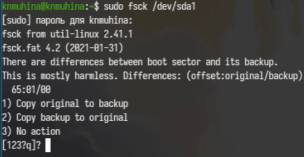

---
## Author
author:
  name: Мухина Ксения Николаевна
  email: 1032253531@pfur.ru
  affilation:
    - name: Российский университет дружбы народов
      country: Российская Федерация
      postal-code: 115419
      city: Москва
      address: ул. Орджоникидзе, д. 3
## Title
title: Анализ файловой системы Linux. Команды для работы с файлами и каталогами
subtitle: Лабораторная работа №7
licence: CC BY-NC
date: today
date-format: "YYYY-MM-DD" # Example: 2025-09-06
---

# Информация

## Докладчик

:::::::::::::: {.columns align=center}
::: {.column width="70%"}

  * Мухина Ксения Николаевна
  * студент 1 курса, бакалавриат
  * компьютерные и информационные науки
  * Российский университет дружбы народов им. П. Лумумбы
  * [1032253531@rudn.ru](mailto:1032253531@rudn.ru)
  * <https://github.com/knmuhina/>

:::
::: {.column width="30%"}

:::
::::::::::::::

# Вводная часть

## Актуальность

- Умение работать с командной строкой необходимо для работы в системах без полноценной графической оболочки
- Знание структуры файловой системы необходимо для её большего понимания и умения работы с ней

## Объект и предмет исследования

- Командная строка
- Файловая система

## Цели и задачи

- Работа с файлами и каталогами:
	- Копирование файлов и каталогов
	- Права доступа
	- Изменение прав доступа
- Анализ файловой системы

# Теоретическое введение

## Команды для работы с файлами и каталогами

- touch
- cat, less, head, tail
- cp, mv
- chmod
- fsck

# Выполнение работы

## Работа с файлами и каталогами

- Была продемонстрирована работа с файлами и каталогами с использованием различных команд.

{#01 width=70%}

## Анализ файловой системы

- Был приведён пример анализа файловой системы.

{#02 width=70%}

# Результаты

## Результаты выполнения работы

- Было проведено ознакомление с файловой системой Linux, её структурой, именами и содержанием
- Были приобретены практические навыки по применению команд для работы с файлами и каталогами, по управлению процессами (и работами), по проверке использования диска и обслуживанию файловой системы

## Контрольные вопросы

- Существуют различные файловые системы для жёстких дисков: ext2/3/4, FAT/FAT32, NTFS
- Файловая система имеет древовидную структуру, начиная с корня /.
- Файловая система создаётся при помощи команды mkfs.
- Команда cp используется для копирования файлов, нескольких файлов, каталогов (-r), подтверждения перезаписи (-i).
- Команда mv используется для перемещения, переименования файлов и перемещения каталогов.
- Права доступа определяют, кто и как может работать с файлом. Изменяются при помощи команды chmod.
