---
## Author
author:
  name: Мухина Ксения Николаевна
  email: 1032253531@rudn.ru
  affiliation:
    - name: Российский университет дружбы народов
      country: Российская Федерация
      postal-code: 115419
      city: Москва
      address: ул. Орджоникидзе, д. 3

## Title
title: "Отчёт по лабораторной работе №7"
subtitle: "Дисциплина: Операционные системы"
license: "CC BY-NC"
---

# Цель работы

Цель данной работы -- ознакомиться с файловой системой Linux, её структурой, именами и содержанием. Приобрести практические навыки по применению команд для работы с файлами и каталогами, по управлению процессами (и работами), по проверке использования диска и обслуживанию файловой системы.

# Задание

Этапы выполнения работы:

- работа с файлами и каталогами:
	- копирование файлов и каталогов
	- права доступа
	- изменение прав доступа
- анализ файловой системы

# Выполнение лабораторной работы

Для начала продемонстрируем примеры, приведённые в описании работы.

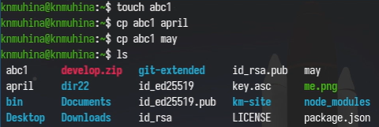{#01 width=70%}

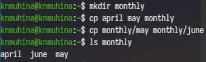{#02 width=70%}

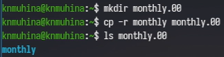{#03 width=70%}

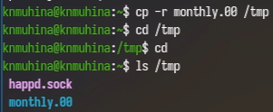{#04 width=70%}

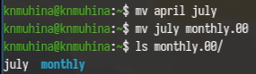{#05 width=70%} 

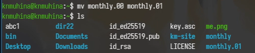{#06 width=70%} 

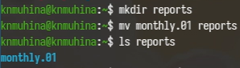{#07 width=70%} 

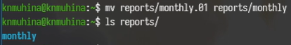{#08 width=70%}

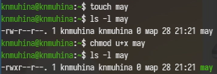{#09 width=70%}

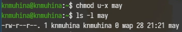{#10 width=70%} 

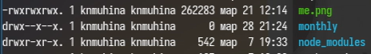{#11 width=70%} 

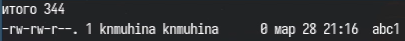{#12 width=70%} 

{#13 width=70%}

Теперь перейдём к основной работе. Скопируем файл в домашний каталог и переименуем. Затем создадим новый каталог, в которым переместим переименованный файл.

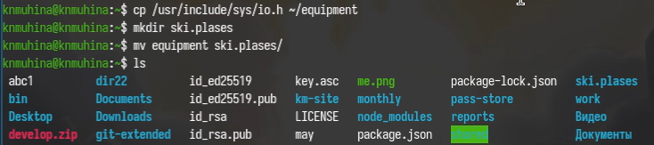{#14 width=70%}

Переименуем каталог equipment.

{#15 width=70%} 

Создадим новый каталог, который скопируем в ski.plases и переименуем. Затем создадим ещё один каталог.

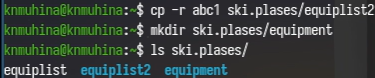{#16 width=70%} 

Переместим каталоги equiplist и equiplist2 в equipment.

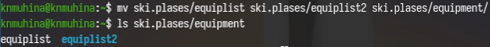{#17 width=70%} 

Создадим новую папку, которую переместим и тут же переименуем.

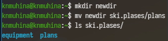{#18 width=70%}

Перейдём к правам доступа.

Зададим следующие права доступа для файлов и каталогов:

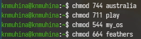{#19 width=70%}

Проверим изменения при помощи ls.

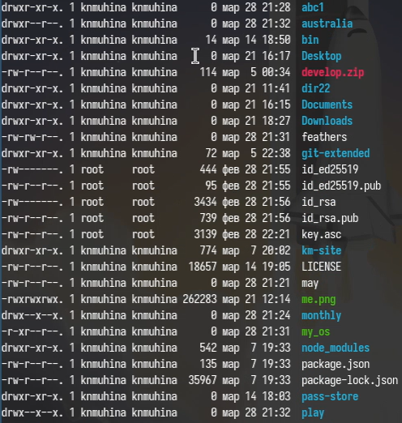{#20 width=70%}

Углубимся в работу с правами доступа.

Посмотрим содержимое /etc/passwd (в данной системе не существует файла password, поэтому команда была изменена).

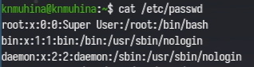{#21 width=70%} 

Скопируем и переместим следующие каталоги:

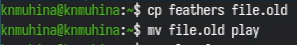{#22 width=70%} 

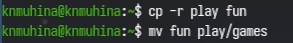{#23 width=70%}

Изменим права доступа для feathers и проверим некоторые команды.

{#24 width=70%}

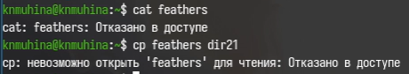{#25 width=70%} 

Как мы видим, вследствие применённой команды мы не можем просматривать или как-либо копировать файл из-за запрета на чтение.

Вернём права.

{#26 width=70%} 

Изменим права для play и проверим на нём cd.

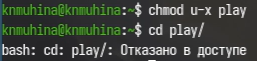{#27 width=70%} 

Как мы видим, из-за запрета на исполнение мы не можем переместиться в данный каталог.

Вернём права и приступим к следующему этапу.

При помощи команды man посмотрим инструкции к некоторым командам.

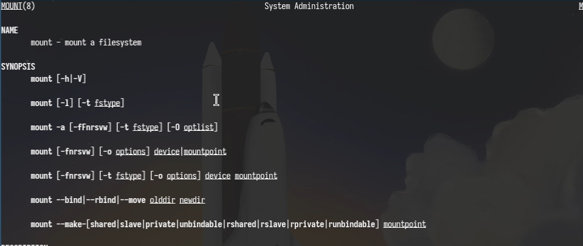{#28 width=70%}

mount позволяет монтировать файловую систему с другого устройства на исходное.

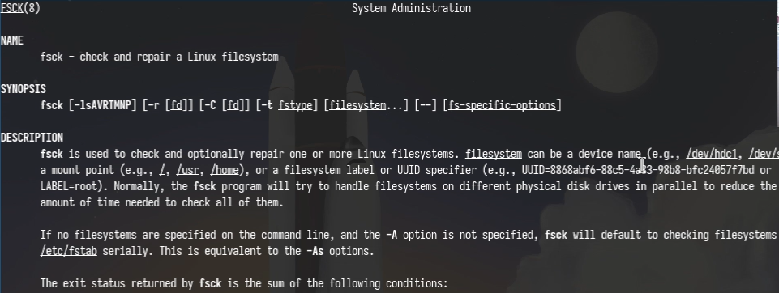{#29 width=70%}

fsck проверяет (и в случае неисправностей исправляет) файловую систему.

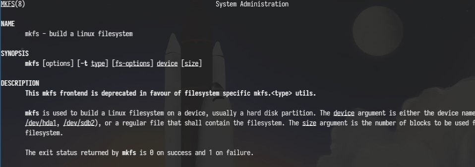{#30 width=70%} 

mkfs создаёт файловую систему.

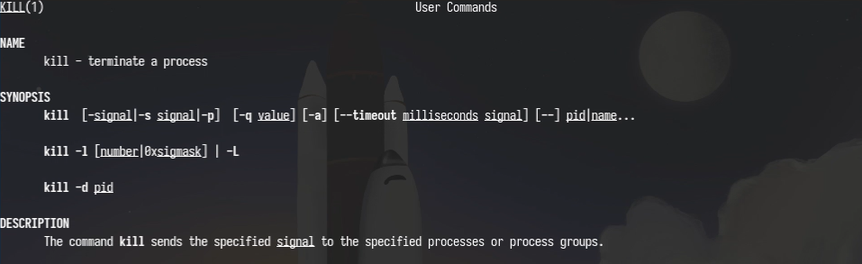{#31 width=70%} 

kill принудительно завершает процесс.

# Выводы

В результате проделанной работы мы ознакомились с файловой системой Linux, её структурой, именами и содержанием; приобрели практические навыки по применению команд для работы с файлами и каталогами, по управлению процессами (и работами), по проверке использования диска и обслуживанию файловой системы.

# Контрольные вопросы

1. Дайте характеристику каждой файловой системе, существующей на жёстком диске компьютера, на котором вы выполняли лабораторную работу.

- ext2 — старая, без журналирования, простая и быстрая
- ext3 — улучшенная ext2 с журналированием (надёжнее)
- ext4 — современная, высокая производительность, поддержка больших файлов
- FAT/FAT32 — простая, совместимая, но с ограничениями
- NTFS — используется в Windows, поддерживает права доступа и большие файлы

2. Приведите общую структуру файловой системы и дайте характеристику каждой директории первого уровня этой структуры.

Файловая система имеет древовидную структуру, начиная с корня /.

Основные каталоги:

- / — корневой каталог
- /home — домашние каталоги пользователей
- /root — домашний каталог администратора
- /bin — основные команды
- /sbin — системные утилиты
- /etc — конфигурационные файлы
- /dev — файлы устройств
- /proc — информация о процессах и системе
- /tmp — временные файлы
- /var — изменяемые данные
- /usr — программы и библиотеки

3.Какая операция должна быть выполнена, чтобы содержимое некоторой файловой системы было доступно операционной системе?

Команда mount.

4. Назовите основные причины нарушения целостности файловой системы. Как устранить повреждения файловой системы?

Причины:

- аварийное выключение питания
- сбои оборудования
- ошибки в работе ОС
- повреждение носителя
- вирусы или ошибки пользователя

Устранение:

- проверка файловой системы через fsck
- восстановление из резервных копий

5. Как создаётся файловая система?

Файловая система создаётся при помощи команды mkfs.

6. Дайте характеристику командам для просмотра текстовых файлов.

- cat — выводит весь файл сразу
- less — постраничный просмотр
- head — показывает начало файла
- tail — показывает конец файла

7. Приведите основные возможности команды cp в Linux.

Команда cp используется для копирования файлов, нескольких файлов, каталогов (-r), подтверждения перезаписи (-i).

8. Приведите основные возможности команды mv в Linux.

Команда mv используется для перемещения, переименования файлов и перемещения каталогов.

9. Что такое права доступа? Как они могут быть изменены?

Права доступа определяют, кто и как может работать с файлом. Изменяются при помощи команды chmod.

# Список литературы{.unnumbered}

1. [Лабораторная работа №7, ТУИС РУДН](https://esystem.rudn.ru/mod/page/view.php?id=1358193)
