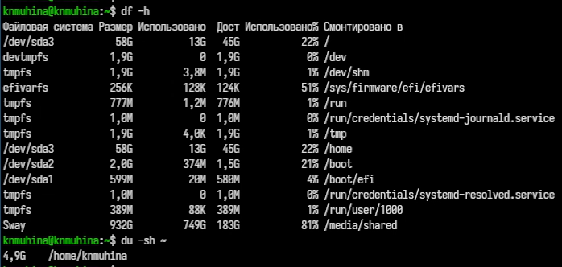

---
## Author
author:
  name: Мухина Ксения Николаевна
  email: 1032253531@pfur.ru
  affilation:
    - name: Российский университет дружбы народов
      country: Российская Федерация
      postal-code: 115419
      city: Москва
      address: ул. Орджоникидзе, д. 3
## Title
title: Поиск файлов. Перенаправление ввода-вывода. Просмотр запущенных процессов
subtitle: Лабораторная работа №8
licence: CC BY-NC
date: today
date-format: "YYYY-MM-DD" # Example: 2025-09-06
---

# Информация

## Докладчик

:::::::::::::: {.columns align=center}
::: {.column width="70%"}

  * Мухина Ксения Николаевна
  * студент 1 курса, бакалавриат
  * компьютерные и информационные науки
  * Российский университет дружбы народов им. П. Лумумбы
  * [1032253531@rudn.ru](mailto:1032253531@rudn.ru)
  * <https://github.com/knmuhina/>

:::
::: {.column width="30%"}

:::
::::::::::::::

# Вводная часть

## Актуальность

- Умение работать с командной строкой необходимо для работы в системах без полноценной графической оболочки
- Изучение инструментов поиска файлов и фильтрации текстовых данных позволяет удобно проделывать работу с текстом.

## Объект и предмет исследования

- Командная строка
- Файловая система

## Цели и задачи

- Поиск файлов
- Работа с процессами:
	- Фоновый запуск процессов
	- Применение команды kill
	- Работа с командами df, du и find

# Теоретическое введение

## Команды для работы с файлами и процессами

- конвейер '|'
- find
- grep
- df
- du
- kill
- ps

# Выполнение работы

## Работа с файлами. Работа с процессами

- Была продемонстрирована работа с файлами с использованием различных команд.
- Также была проведена работа с процессами: были применены такие команды как pid, pgrep, kill, df, du

{#01 width=70%}

# Результаты

## Результаты выполнения работы

- Было проведено ознакомление с с инструментами поиска файлов и фильтрации текстовых данных
- Были приобретены практические навыки по управлению процессами (и заданиями), по проверке использования диска и обслуживанию файловых систем

## Контрольные вопросы

- Существуют различные стандартные потоки: stdin (0), stdout (1), stderr (2)
- '>' перезаписывает файл (старое содержимое удаляется), '>>' дописывает данные в конец файла
- Конвейер - механизм, который позволяет передать вывод одной команды на вход другой
- Программа - файл, содержащий код. Процесс - программа, выполняющаяся в памяти. PID - уникальный идентификатор процесса
- Задачи - процессы, запущенные в текущем терминале
- find и grep позволяют искать файлы по различным фильтрам
- df и du позволяют проверить использование диска
