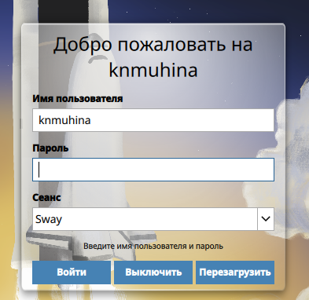
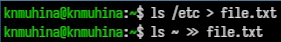
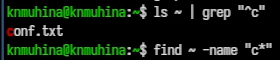
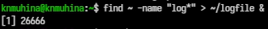
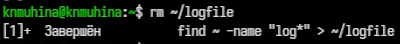
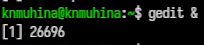
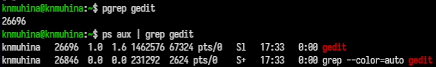
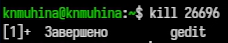

---
## Author
author:
  name: Мухина Ксения Николаевна
  email: 1032253531@rudn.ru
  affiliation:
    - name: Российский университет дружбы народов
      country: Российская Федерация
      postal-code: 115419
      city: Москва
      address: ул. Орджоникидзе, д. 3

## Title
title: "Отчёт по лабораторной работе №8"
subtitle: "Дисциплина: Операционные системы"
license: "CC BY-NC"
---

# Цель работы

Цель данной работы -- ознакомление с инструментами поиска файлов и фильтрации текстовых данных. Приобретение практических навыков: по управлению процессами (и заданиями), по проверке использования диска и обслуживанию файловых систем.

# Задание

Этапы выполнения работы:

- поиск файлов
- работа с процессами
	- фоновый запуск процессов
	- применение команды kill
	- работа с командами df, du и find

# Выполнение лабораторной работы

Для начала осуществим вход в систему.

{#01 width=70%}

Запишем в file.txt названия файлов, содержащихся в /etc. И также допишем названия файлов, содержащиеся в ~.

{#02 width=70%}

Найдём все .conf файлы и запишем их в новый текстовый файл conf.txt.

{#03 width=70%}

Найдём несколькими способами файлы в каталоге ~, начинающиеся с 'c'.

{#04 width=70%}

Выведем постранично имена файлов из /etc, начинающиеся с 'h'.

{#05 width=70%} 

Запустим фоновый процесс записи файлов, начинающихся с 'log', в файл ~/logfile.

{#06 width=70%} 

Удалим файл logfile.

{#07 width=70%} 

Запустим gedit в фоновом режиме.

{#08 width=70%}

Определим PID процесса gedit несколькими способами: предложенным в работе и при помощи pgrep.

{#09 width=70%}

Завершим процесс gedit при помощи kill.

{#10 width=70%} 

Выполним команды df и du, перед этим получив информацию о них.

{#11 width=70%} 

Выведем имена всех директорий каталога ~ при помощи find.

{#12 width=70%}

# Выводы

В результате проделанной работы мы ознакомились с инструментами поиска файлов и фильтрации текстовых данных; приобрели практические навыки по управлению процессами (и заданиями), по проверке использования диска и обслуживанию файловых систем.

# Контрольные вопросы

1. Какие потоки ввода вывода вы знаете?

Существует три стандартных потока:

- stdin (0) - стандартный ввод (обычно клавиатура)
- stdout (1) - стандартный вывод (обычно терминал)
- stderr (2) - поток ошибок (вывод сообщений об ошибках)

2. Объясните разницу между операцией > и >>.

'>' перезаписывает файл (старое содержимое удаляется), '>>' дописывает данные в конец файла.

3. Что такое конвейер?

Конвейер - механизм, который позволяет передать вывод одной команды на вход другой.

4. Что такое процесс? Чем это понятие отличается от программы?

Программа - файл, содержащий код. Процесс - программа, выполняющаяся в памяти.

5. Что такое PID и GID?

PID - уникальный идентификатор процесса. GID - идентификатор группы пользователей.

6. Что такое задачи и какая команда позволяет ими управлять?

Задачи - процессы, запущенные в текущем терминале.

Команды:

- 'jobs' — список задач
- 'kill {номер}' — завершить задачу
- 'fg' — вернуть в передний план
- 'bg' — продолжить в фоне

7. Найдите информацию об утилитах top и htop. Каковы их функции?

top показывает процессы в реальном времени, htop - улучшенная версия `top` с удобным интерфейсом.

8. Назовите и дайте характеристику команде поиска файлов. Приведите примеры использования этой команды.

Основная команда - 'find'

Позволяет искать файлы по имени, типу, размеру, дате.

Примеры:

```bash
find ~ -name "*.txt"
find /etc -type f
```

9. Можно ли по контексту (содержанию) найти файл? Если да, то как?

Да, с помощью 'grep'.

10. Как определить объем свободной памяти на жёстком диске?

```bash
df -h
```

11. Как определить объем вашего домашнего каталога?

```bash
du -sh ~
```

12. Как удалить зависший процесс?

1. Найти PID:

```bash
ps aux | grep имя
```

2. Завершить:

```bash
kill PID
```

3. Если не помогло:

```bash
kill -9 PID
```

# Список литературы{.unnumbered}

1. [Лабораторная работа №8, ТУИС РУДН](https://esystem.rudn.ru/mod/page/view.php?id=1358195)
