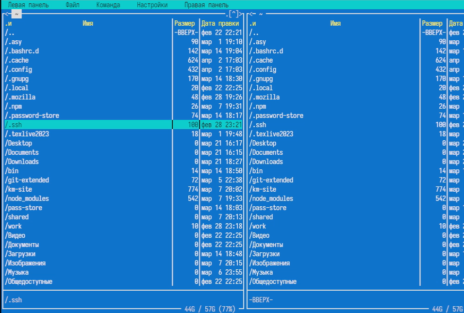
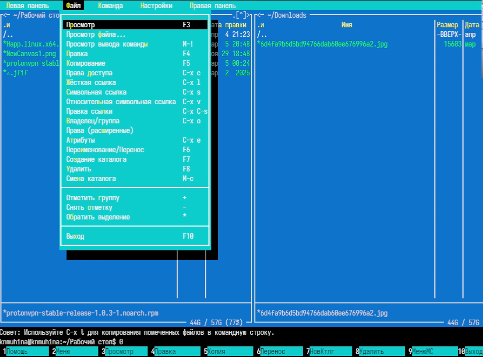

---
## Author
author:
  name: Мухина Ксения Николаевна
  email: 1032253531@pfur.ru
  affilation:
    - name: Российский университет дружбы народов
      country: Российская Федерация
      postal-code: 115419
      city: Москва
      address: ул. Орджоникидзе, д. 3
## Title
title: Командная оболочка Midnight Commander
subtitle: Лабораторная работа №9
licence: CC BY-NC
date: today
date-format: "YYYY-MM-DD" # Example: 2025-09-06
---

# Информация

## Докладчик

:::::::::::::: {.columns align=center}
::: {.column width="70%"}

  * Мухина Ксения Николаевна
  * студент 1 курса, бакалавриат
  * компьютерные и информационные науки
  * Российский университет дружбы народов им. П. Лумумбы
  * [1032253531@rudn.ru](mailto:1032253531@rudn.ru)
  * <https://github.com/knmuhina/>

:::
::: {.column width="30%"}

:::
::::::::::::::

# Вводная часть

## Актуальность

- Умение работать с командной строкой необходимо для работы в системах без полноценной графической оболочки
- Знание возможностей командной оболочки Midnight Commander позволяет проще взаимодействовать с ОС и ПО посредством команд

## Объект и предмет исследования

- Командная строка
- Midnight Commander

## Цели и задачи

- Работа с mc:
	- Изучение mc
	- Выполнение различных операций и команд
	- Использование подменю
- Задание по встроенному редактору mc:
	- Работа с текстовым файлом
	- Использование горячих клавиш
	- Работа с прочими функциями mc

# Теоретическое введение

## Общие сведения

- Командная оболочка — интерфейс взаимодействия пользователя с операционной системой и программным обеспечением посредством команд
- Midnight Commander (или mc) — псевдографическая командная оболочка для UNIX/Linux систем

{#01 width=70%}

# Выполнение работы

## Работа в mc

- Было проведено изучение mc
- Была продемонстрирована работа со встроенным редактором mc

{#02 width=70%}

# Результаты

## Результаты выполнения работы

- Было проведено освоение основных возможностей командной оболочки Midnight Commander
- Были приобретены навыки практической работы по просмотру каталогов и файлов, манипуляций с ними

## Контрольные вопросы

- Существует несколько режимов работы в mc
- Некоторые операции можно выполнить и в shell, и в mc
- Основные горячие клавиши редактора mc: F2, F10, Ctrl+Y, Ctrl+U, F7, F4, F3, F5/F6, F8
