---
## Author
author:
  name: Мухина Ксения Николаевна
  email: 1032253531@rudn.ru
  affiliation:
    - name: Российский университет дружбы народов
      country: Российская Федерация
      postal-code: 115419
      city: Москва
      address: ул. Орджоникидзе, д. 3

## Title
title: "Отчёт по лабораторной работе №9"
subtitle: "Дисциплина: Операционные системы"
license: "CC BY-NC"
---

# Цель работы

Цель данной работы -- освоить основные возможности командной оболочки Midnight Commander. Приобрести навыки практической работы по просмотру каталогов и файлов; манипуляций с ними.

# Задание

Этапы выполнения работы:

- Работа с mc:
	- изучение mc
	- выполнение различных операций и команд
	- использование подменю
- Задание по встроенному редактору mc:
	- работа с текстовым файлом
	- использование горячих клавиш
	- работа с прочими функциями mc

# Выполнение лабораторной работы

Для начала изучим информацию о mc.

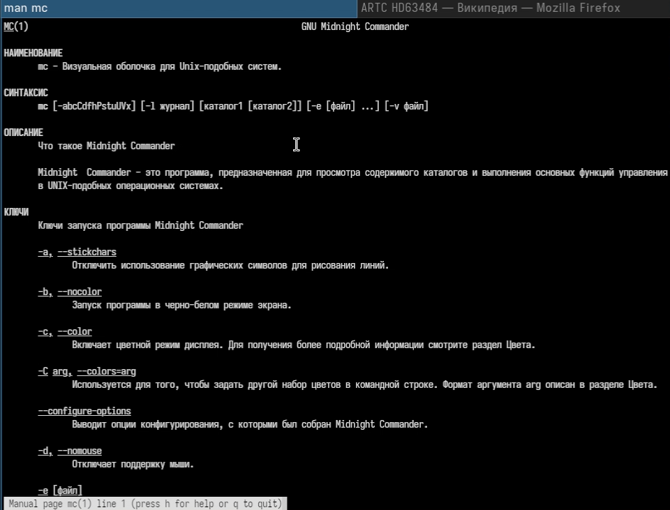{#01 width=70%}

Затем запустим mc и изучим структуру и меню. После изучения выполним несколько операций, используя управляющие клавиши.

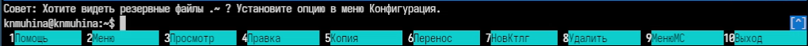{#02 width=70%}

Выполним основные команды меню одной из панелей.

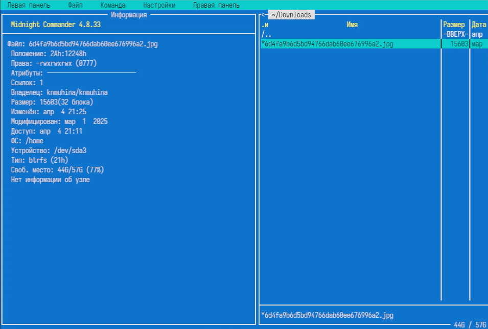{#03 width=70%}

О файле выводится такая информация как имя, формат, права, атрибуты, ссылки, владелец, размер и т.д.

Выполним некоторые действия, используя подменю Файл.

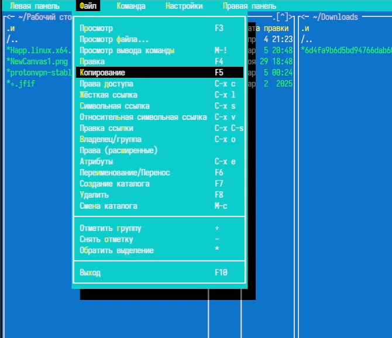{#04 width=70%}

Выполним некоторые действия, используя подменю Команда.

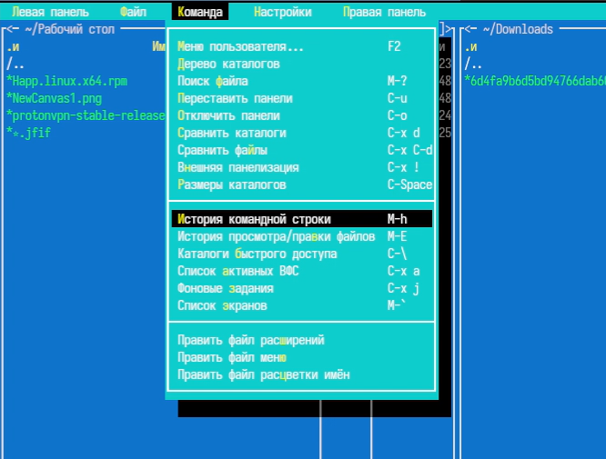{#05 width=70%} 

Вызовем подменю Настройки и освоим некоторые операции, определяющие структуру экрана mc.

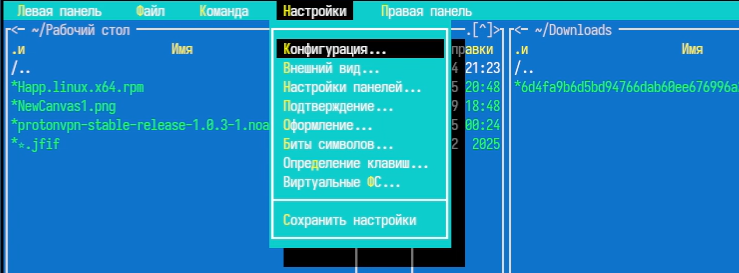{#06 width=70%} 

Далее приступим к работе со встроенным редактором mc.

Создадим текстовый файл text.txt и откроем с помощью mc.

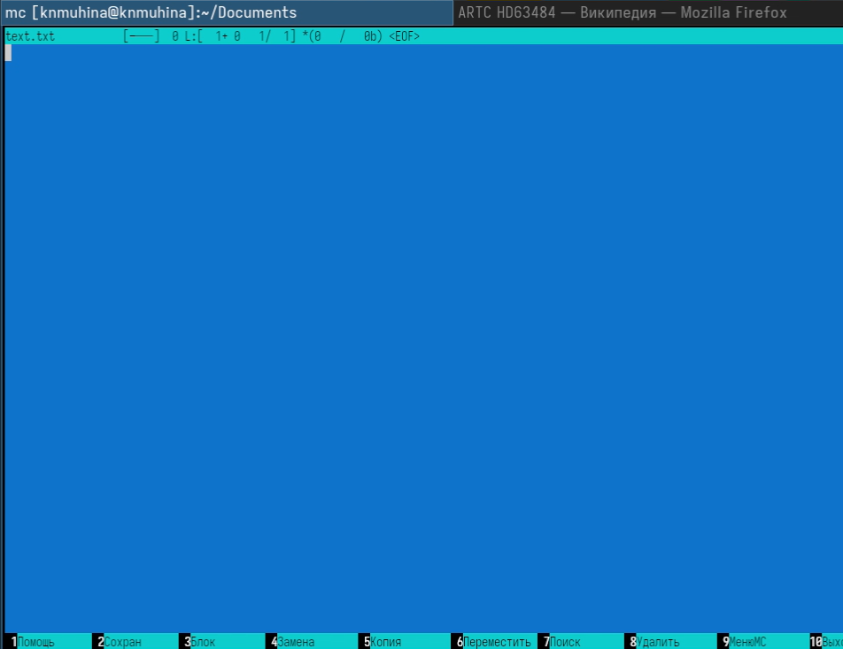{#07 width=70%} 

Вставим в файл небольшой фрагмент текста.

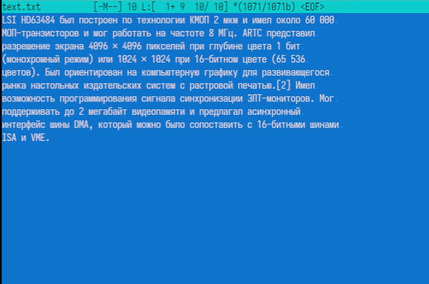{#08 width=70%}

Проделаем некоторые манипуляции, используя горячие клавиши.

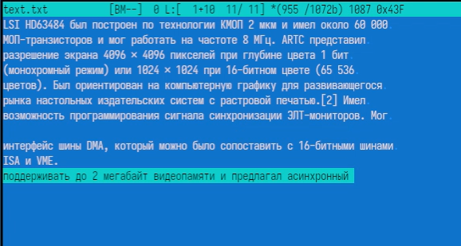{#09 width=70%}

После проделанных операций откроем файл с исходным текстом на языке программирования C++.

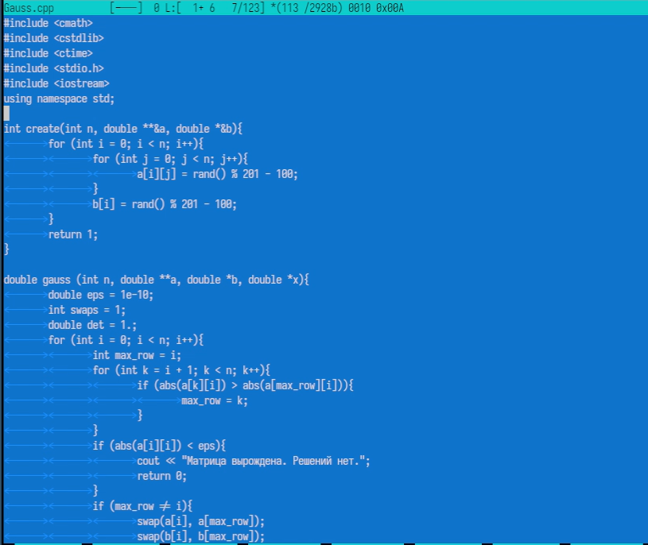{#10 width=70%} 

Изменим параметр подсветки синтаксиса.

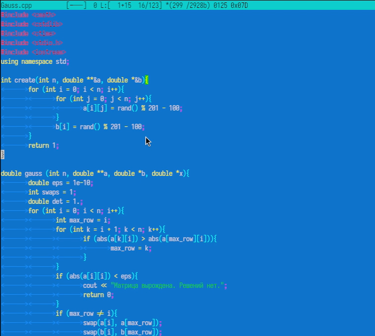{#11 width=70%} 

# Выводы

В результате проделанной работы мы ознакомились с основными возможностями командной оболочки Midnight Commander; приобрели практические навыки работы по просмотру каталогов и файлов, манипуляций с ними.

# Контрольные вопросы

1. Какие режимы работы есть в mc? Охарактеризуйте их.

- Обычный режим - список файлов и каталогов
- Информация - отображает сведения о выбранном файле и системе
- Дерево - показывает структуру каталогов в виде дерева
- Быстрый просмотр - просмотр содержимого файла

2. Какие операции с файлами можно выполнить как с помощью команд shell, так и с помощью меню (комбинаций клавиш) mc? Приведите несколько примеров.

- Копирование файлов
- Перемещение файлов
- Удаление файлов
- Создание каталогов
- Просмотр файлов
- Редактирование файлов

Примеры:

- cp - F5
- mv - F6
- rm - F8
- mkdir - F7

3. Опишите структура меню левой (или правой) панели mc, дайте характеристику командам.

Меню панелей (левая/правая) содержит:

- Формат списка - способ отображения файлов
- Сортировка - по имени, размеру, дате
- Режимы отображения - дерево, информация
- Быстрый просмотр - просмотр содержимого

4. Опишите структуру меню Файл mc, дайте характеристику командам.

Содержит операции над файлами:

- Просмотр (F3) - просмотр файла
- Редактирование (F4) - изменение файла
- Копирование (F5)
- Перемещение/переименование (F6)
- Удаление (F8)
- Создание каталога (F7)
- Права доступа - изменение прав
- Ссылки - создание жёстких и символических ссылок

5. Опишите структуру меню Команда mc, дайте характеристику командам.

- Дерево каталогов - структура файловой системы
- Поиск файлов - поиск по параметрам
- Сравнение каталогов
- История команд
- Быстрый переход по каталогам
- Редактирование меню и расширений

6. Опишите структуру меню Настройки mc, дайте характеристику командам.

- Конфигурация - общие настройки
- Внешний вид - отображение элементов
- Настройки панелей
- Подтверждения - запросы перед удалением
- Распознавание клавиш
- Виртуальные файловые системы

7. Назовите и дайте характеристику встроенным командам mc.

- Навигация по каталогам
- Копирование, перемещение, удаление файлов
- Просмотр и редактирование
- Поиск файлов
- Работа с правами доступа

Выполняются через функциональные клавиши и меню.

8. Назовите и дайте характеристику командам встроенного редактора mc.

Основные горячие клавиши:

- F2 - сохранить
- F10 - выйти
- Ctrl+Y - удалить строку
- Ctrl+U - отмена
- F7 - поиск
- F4 - замена
- F3 - выделение
- F5/F6 - копирование/перемещение
- F8 - удаление

9. Дайте характеристику средствам mc, которые позволяют создавать меню, определяемые пользователем.

- Вызываются через F2
- Используется файл пользовательского меню
- Позволяют создавать собственные команды
- Можно автоматизировать действия

10. Дайте характеристику средствам mc, которые позволяют выполнять действия, определяемые пользователем, над текущим файлом.

Файл расширений (mc.ext) позволяет задать:

- чем открывать файл
- какие действия выполнять

# Список литературы{.unnumbered}

1. [Лабораторная работа №9, ТУИС РУДН](https://esystem.rudn.ru/mod/page/view.php?id=1358197)
