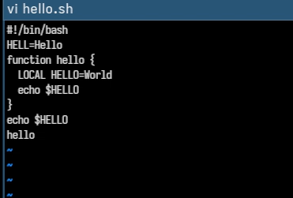

---
## Author
author:
  name: Мухина Ксения Николаевна
  email: 1032253531@pfur.ru
  affilation:
    - name: Российский университет дружбы народов
      country: Российская Федерация
      postal-code: 115419
      city: Москва
      address: ул. Орджоникидзе, д. 3
## Title
title: Текстовой редактор vi
subtitle: Лабораторная работа №10
licence: CC BY-NC
date: today
date-format: "YYYY-MM-DD" # Example: 2025-09-06
---

# Информация

## Докладчик

:::::::::::::: {.columns align=center}
::: {.column width="70%"}

  * Мухина Ксения Николаевна
  * студент 1 курса, бакалавриат
  * компьютерные и информационные науки
  * Российский университет дружбы народов им. П. Лумумбы
  * [1032253531@rudn.ru](mailto:1032253531@rudn.ru)
  * <https://github.com/knmuhina/>

:::
::: {.column width="30%"}

:::
::::::::::::::

# Вводная часть

## Актуальность

- Умение работать с командной строкой необходимо для работы в системах без полноценной графической оболочки
- Умение работать с редактором vi позволяет эффективно использовать встроенные утилиты для повседневных задач

## Объект и предмет исследования

- Командная строка
- Редактор vi

## Цели и задачи

- Работа с vi:
	- Создание нового исполняемого файла
	- Редактирование файла

# Теоретическое введение

## Основные группы команд редактора

- Команды управления курсором (стрелки, Space, Enter)
- Команды позиционирования (0, $, G)
- Команды перемещения по файлу (Ctrl-d, Ctrl-u, Ctrl-f, Ctrl-b)
- Команды перемещения по словам (W/w, nW/nw, B/b nB/nb)

## Команды редактирования

- Вставка текста (A/a, i/I), строки (O/o)
- Удаление текста (x, dw, d$, d0, dd)
- Отмена/повтор изменений (u, .)
- Копирование/вставка (Y/yw, P/p)
- Замена текста (cw, c$, r, R)
- Поиск текста (/текст, ?текст)

## Команды редактирования в режиме командной строки

- Копирование и перемещение текста (:[n,m]d, :[i,j],[k])
- Запись в файл и выход из редактора (:w, :q)

## Опции

- :set all
- :set nu
- :set list
- :set ic

# Выполнение работы

## Создание нового файла. Редактирование файла

- Была продемонстрирована работа с файлом с использованием встроенного редактора vi.

{#01 width=70%}

# Результаты

## Результаты выполнения работы

- Было проведено ознакомление с системой Linux
- Были приобретены практические навыки работы с редактором vi

## Контрольные вопросы

- В редакторе vi есть 3 режима
- Команды позиционирования позволяют быстро перемещать курсор по файлу
- Слово - это последовательность символов без пробелов
- В целом количество опций в vi зависит от версии vi
