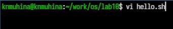
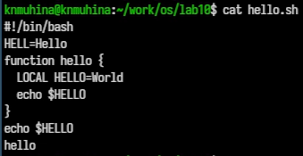
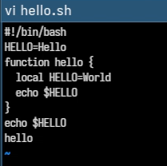
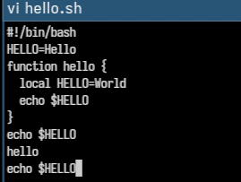

---
## Author
author:
  name: Мухина Ксения Николаевна
  email: 1032253531@rudn.ru
  affiliation:
    - name: Российский университет дружбы народов
      country: Российская Федерация
      postal-code: 115419
      city: Москва
      address: ул. Орджоникидзе, д. 3

## Title
title: "Отчёт по лабораторной работе №10"
subtitle: "Дисциплина: Операционные системы"
license: "CC BY-NC"
---

# Цель работы

Цель данной работы -- познакомиться с операционной системой Linux. Получить практические навыки работы с редактором vi, установленным по умолчанию практически во всех дистрибутивах.

# Задание

Этапы выполнения работы:

- работа с vi:
	- создание нового исполняемого файла
	- редактирование файла
- ответы на контрольные вопросы

# Выполнение лабораторной работы

Для начала создадим каталог ~/work/os/lab10 и перейдём в него. Там вызовем vi и создадим hello.sh.

{#01 width=70%}

Введём следующий текст.

{#02 width=70%}

Перейдём в командный режим, запишем изменения и выйдем через команду :wq.

Проверим изменения через cat.

{#03 width=70%}

Изменим права доступа, сделав файл исполняемым.

{#04 width=70%}

Снова откроем файл и проведём некоторые операции. Например, заменим слово LOCAL на local.

{#05 width=70%} 

Или добавим и затем удалим последнюю строку.

{#06 width=70%} 

{#07 width=70%} 

Сохраним изменения и выйдем из редактора.

# Выводы

В результате проделанной работы мы познакомились с операционной системой Linux; получили практические навыки работы с редактором vi, установленным по умолчанию практически во всех дистрибутивах.

# Контрольные вопросы

1. Дайте краткую характеристику режимам работы редактора vi.

В редакторе vi есть 3 режима:

- Командный - основной режим, используется для навигации и выполнения команд.
- Режим вставки - ввод и редактирование текста.
- Режим последней строки (командной строки) - сохранение, выход, работа с файлами и настройками.

2. Как выйти из редактора, не сохраняя произведённые изменения?

```
:q!
```

3. Назовите и дайте краткую характеристику командам позиционирования.

Позволяют быстро перемещаться:

- 0 - в начало строки
- $ - в конец строки
- G - в конец файла
- nG - перейти к строке номер n

4. Что для редактора vi является словом?

Слово - это:

- последовательность символов без пробелов
- при w/b - учитываются знаки препинания
- при W/B - только пробелы как разделители

5. Каким образом из любого места редактируемого файла перейти в начало (конец) файла?

- В начало файла: gg
- В конец файла: G

6. Назовите и дайте краткую характеристику основным группам команд редактирования.

- Вставка текста: `i`, `a`, `A`, `I`
- Удаление: `x`, `dd`, `dw`
- Копирование: `y`, `Y`
- Вставка: `p`, `P`
- Замена: `cw`, `r`, `R`
- Отмена/повтор: `u`, `.`

7. Необходимо заполнить строку символами $. Каковы ваши действия?

- Перейти в начало строки (`0`)
- Нажать `R` (режим замены)
- Зажать `$` до конца строки
- `Esc`

8. Как отменить некорректное действие, связанное с процессом редактирования?

- `u` - отмена последнего действия

9. Назовите и дайте характеристику основным группам команд режима последней строки.

- Сохранение: `:w`
- Выход: `:q`, `:q!`
- Сохранение + выход: `:wq`
- Работа с диапазонами строк: `:n,m d`, `:n,m t k`
- Настройки: `:set`

10. Как определить, не перемещая курсора, позицию, в которой заканчивается строка?

```
$
```

11. Выполните анализ опций редактора vi (сколько их, как узнать их назначение и т.д.).

Посмотреть все опции:

  ```
  :set all
  ```
Включить опцию:

  ```
  :set nu
  ```
Выключить:

  ```
  :set nonu
  ```
Узнать назначение — через документацию:

  ```
  :help set
  ```

В целом количество опций зависит от версии vi.

12. Как определить режим работы редактора vi?

- Если вводится текст — режим вставки
- Если команды — командный режим
- Если внизу строка с `:` — режим последней строки

13. Постройте граф взаимосвязи режимов работы редактора vi.

Простой вид:

```
          Esc
Вставка --------> Командный
   ^                 |
   |                 | :
   |                 v
   <-------- Последняя строка
            (Enter / Esc)
```

# Список литературы{.unnumbered}

1. [Лабораторная работа №10, ТУИС РУДН](https://esystem.rudn.ru/mod/page/view.php?id=1358199)
