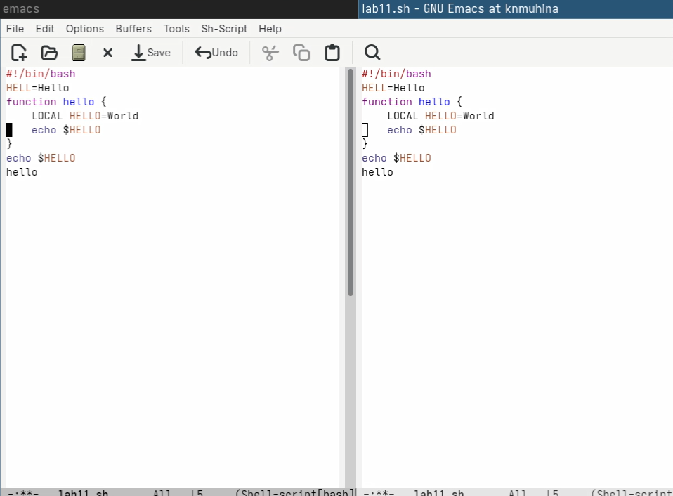

---
## Author
author:
  name: Мухина Ксения Николаевна
  email: 1032253531@pfur.ru
  affilation:
    - name: Российский университет дружбы народов
      country: Российская Федерация
      postal-code: 115419
      city: Москва
      address: ул. Орджоникидзе, д. 3
## Title
title: Текстовой редактор emacs
subtitle: Лабораторная работа №11
licence: CC BY-NC
date: today
date-format: "YYYY-MM-DD" # Example: 2025-09-06
---

# Информация

## Докладчик

:::::::::::::: {.columns align=center}
::: {.column width="70%"}

  * Мухина Ксения Николаевна
  * студент 1 курса, бакалавриат
  * компьютерные и информационные науки
  * Российский университет дружбы народов им. П. Лумумбы
  * [1032253531@rudn.ru](mailto:1032253531@rudn.ru)
  * <https://github.com/knmuhina/>

:::
::: {.column width="30%"}

:::
::::::::::::::

# Вводная часть

## Актуальность

- Умение работать с командной строкой необходимо для работы в системах без полноценной графической оболочки
- Умение работать с редактором emacs позволяет эффективно использовать утилиты для повседневных задач

## Объект и предмет исследования

- Командная строка
- Редактор emacs

## Цели и задачи

- Работа с emacs:
	- Создание нового исполняемого файла
	- Изучение основных команд emacs
	- Изучение прочих функций emacs

# Теоретическое введение

## Основные термины Emacs

- Буфер
- Фрейм
- Окно
- Область вывода
- Минибуфер
- Точка вставки
- Режим

## Регулярные выражения

- При работе с командами Emacs можно использовать регулярные выражения (., *, Tab, +, ?, etc.)
- Основные отличия от PCRE:
	- `\s` не задаёт пробел
	- `\t` не задаёт табуляцию
	- операция «или» и скобки группировки экранируются

# Выполнение работы

## Работа с emacs

- Была проведена работа с emacs и были изучены его функции
- Была продемонстрирована работа с файлом с использованием редактора emacs

{#01 width=70%}

# Результаты

## Результаты выполнения работы

- Было проведено ознакомление с системой Linux
- Были приобретены практические навыки работы с редактором emacs

## Контрольные вопросы

- Emacs - мощный расширяемый текстовый редактор, работающий через сочетания клавиш и поддерживающий множество режимов и функций
- Некоторые особенности данного редактора могут сделать его сложным для освоения новичком
- По умолчанию создаются буферы `*scratch*` и `*Messages*`
- Настройки обычно хранятся в ~/.emacs
- Клавиша '->' используется как модификатор (Alt или Esc). Её можно переназначить
- Emacs удобнее для сложной работы благодаря расширяемости и встроенным возможностям. Однако vi быстрее для простого редактирования, так как требует меньше действий.
