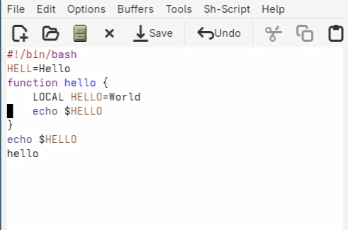
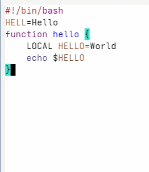
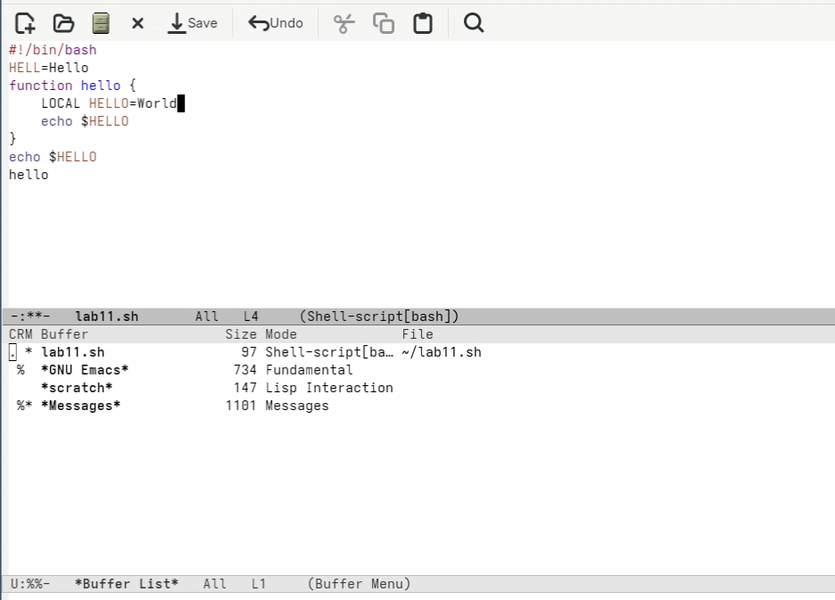

---
## Author
author:
  name: Мухина Ксения Николаевна
  email: 1032253531@rudn.ru
  affiliation:
    - name: Российский университет дружбы народов
      country: Российская Федерация
      postal-code: 115419
      city: Москва
      address: ул. Орджоникидзе, д. 3

## Title
title: "Отчёт по лабораторной работе №11"
subtitle: "Дисциплина: Операционные системы"
license: "CC BY-NC"
---

# Цель работы

Цель данной работы -- познакомиться с операционной системой Linux. Получить практические навыки работы с редактором emacs.

# Задание

Этапы выполнения работы:

- работа с emacs:
	- создание нового исполняемого файла
	- изучение основных команд emacs
	- изучение прочих функций emacs
- ответы на контрольные вопросы

# Выполнение лабораторной работы

Откроем emacs и при помощи сочетания C-x C-f создадим файл lab11.sh. Запишем в него следующий текст.

{#01 width=70%}

Проделаем несколько операций: например, вырез одной командой нескольких строк.

{#02 width=70%}

Также была выполнена демонстрация других команд, таких как перемещение курсора в начало/конец строки, управление буферами, окнами и режим поиска.

{#03 width=70%}

В emacs есть 2 различных способа поиска: C-s и M-s o. Второй удобен тем, что, в отличие от первого способа, можно свободно переключаться между результатами поиска при помощи курсора мыши, когда как в первом надо нажимать C-s для перехода к следующему результату.

# Выводы

В результате проделанной работы мы познакомились с операционной системой Linux; получили практические навыки работы с редактором emacs.

# Контрольные вопросы

1. Кратко охарактеризуйте редактор emacs.

Emacs - мощный расширяемый текстовый редактор, работающий через сочетания клавиш и поддерживающий множество режимов и функций.

2. Какие особенности данного редактора могут сделать его сложным для освоения новичком?

- большое количество комбинаций клавиш
- непривычная система управления
- необходимость запоминания команд
- высокая гибкость (много настроек)

3. Своими словами опишите, что такое буфер и окно в терминологии emacs’а.

- Буфер - содержимое (текст, данные)
- Окно - область на экране, где отображается буфер

4. Можно ли открыть больше 10 буферов в одном окне?

Да, количество буферов практически не ограничено.

5. Какие буферы создаются по умолчанию при запуске emacs?

- `*scratch*` - для заметок
- `*Messages*` - сообщения системы

6. Какие клавиши вы нажмёте, чтобы ввести следующую комбинацию C-c | и C-c C-|?

- `C-c |` → Ctrl + c, затем `|`
- `C-c C-|` → Ctrl + c, затем Ctrl + `|`

7. Как поделить текущее окно на две части?

- горизонтально: `C-x 2`
- вертикально: `C-x 3`

8. В каком файле хранятся настройки редактора emacs?

```bash
~/.emacs
```

или

```bash
~/.emacs.d/init.el
```

9. Какую функцию выполняет клавиша '->' и можно ли её переназначить?

Используется как модификатор (Alt или Esc). Её можно переназначить.

10. Какой редактор вам показался удобнее в работе vi или emacs? Поясните почему.

Emacs удобнее для сложной работы благодаря расширяемости и встроенным возможностям. Однако vi быстрее для простого редактирования, так как требует меньше действий.

# Список литературы{.unnumbered}

1. [Лабораторная работа №11, ТУИС РУДН](https://esystem.rudn.ru/mod/page/view.php?id=1358201)
