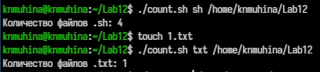

---
## Author
author:
  name: Мухина Ксения Николаевна
  email: 1032253531@pfur.ru
  affilation:
    - name: Российский университет дружбы народов
      country: Российская Федерация
      postal-code: 115419
      city: Москва
      address: ул. Орджоникидзе, д. 3
## Title
title: Программирование в командном процессоре ОС UNIX. Командные файлы
subtitle: Лабораторная работа №12
licence: CC BY-NC
date: today
date-format: "YYYY-MM-DD" # Example: 2025-09-06
---

# Информация

## Докладчик

:::::::::::::: {.columns align=center}
::: {.column width="70%"}

  * Мухина Ксения Николаевна
  * студент 1 курса, бакалавриат
  * компьютерные и информационные науки
  * Российский университет дружбы народов им. П. Лумумбы
  * [1032253531@rudn.ru](mailto:1032253531@rudn.ru)
  * <https://github.com/knmuhina/>

:::
::: {.column width="30%"}

:::
::::::::::::::

# Вводная часть

## Актуальность

- Умение работать с командной строкой необходимо для работы в системах без полноценной графической оболочки
- Изучение основ программирования в оболочке ОС UNIX/Linux даёт возможность писать программы для различных нужд

## Объект и предмет исследования

- Командная строка
- Командный процессор UNIX

## Цели и задачи

- Работа со скриптами/командными файлами
	- Скрипт резервной копии
	- Скрипт обработки аргументов КС
	- Скрипт-аналог ls
	- Скрипт вычисления кол-ва файлов данного формата

# Теоретическое введение

## Командные процессоры (оболочки)

- оболочка Борна (Bourne shell или sh)
- С-оболочка (или csh)
- оболочка Корна (или ksh)
- BASH — сокращение от Bourne Again Shell

## Переменные в языке программирования bash

- Командный процессор bash обеспечивает возможность использования переменных
типа строка символов

## Использование арифметических вычислений. Операторы let и read

- Оболочка bash поддерживает встроенные арифметические функции
- let является показателем того, что последующие аргументы представляют собой выражение, подлежащее вычислению
- read позволяет читать значения переменных со стандартного ввода

## Метасимволы и их экранирование

- При перечислении имён файлов текущего каталога можно использовать следующие
символы:
	- '*'
	- ?
	- [c1-c2]
- Примеры:
	- echo *
	- ls *.c
	- echo prog.?
	- [a-z]*

## Командные файлы и функции

- Последовательность команд может быть помещена в текстовый файл. Такой файл
называется командным
- Такой файл выполняется по команде bash командный_файл [аргументы]
- Передача параметров в командные файлы и специальные переменные

## Использование команды getopts. Флаги

- getopts, которая осуществляет синтаксический анализ командной строки, выделяя флаги, и используется для объявления переменных
- Синтаксис: getopts option-string variable [arg ... ]
- Флаги — это опции командной строки, обычно помеченные знаком минус

## Управление последовательностью действий в командных файлах

- Циклы for
- Выбор case
- Условный оператор if
- Циклы while, until
- Прерывание циклов

# Выполнение работы

## Работа со скриптами

- Было написано несколько скриптов под различные нужды
- Также была продемонстрирована их работа

{#01 width=70%}

# Результаты

## Результаты выполнения работы

- Были изучены основы программирования в оболочке ОС UNIX/Linux
- Были приобретены навыки написания небольших командных файлов

## Контрольные вопросы

- Командная оболочка (shell) — это программа, которая обеспечивает взаимодействие пользователя с ОС через команды. Примеры: bash, sh, csh, ksh
- POSIX — стандарт, определяющий интерфейсы ОС для обеспечения переносимости программ между UNIX-подобными системами.
- `let` — выполняет арифметические операции, `read` — считывает ввод пользователя
- В bash можно применять операции `+`, `-`, `*`, `/`, `%`.
- (( )) — форма записи арифметических выражений и условий.
- Стандартные имена переменных: `PATH`, `HOME`, `USER` / `LOGNAME`, `PS1`.
