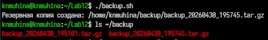
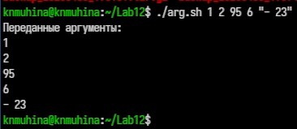
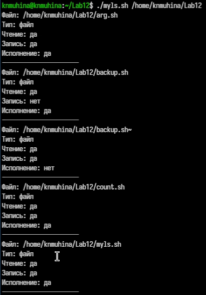

---
## Author
author:
  name: Мухина Ксения Николаевна
  email: 1032253531@rudn.ru
  affiliation:
    - name: Российский университет дружбы народов
      country: Российская Федерация
      postal-code: 115419
      city: Москва
      address: ул. Орджоникидзе, д. 3

## Title
title: "Отчёт по лабораторной работе №12"
subtitle: "Дисциплина: Операционные системы"
license: "CC BY-NC"
---

# Цель работы

Цель данной работы -- изучить основы программирования в оболочке ОС UNIX/Linux. Научиться писать небольшие командные файлы.

# Задание

Этапы выполнения работы:

- работа со скриптами/командными файлами
	- скрипт резервной копии
	- скрипт обработки аргументов КС
	- скрипт-аналог ls
	- скрипт вычисления кол-ва файлов данного формата
- ответы на контрольные вопросы

# Выполнение лабораторной работы

Для начала напишем скрипт резервной копии самого себя в соответствии с заданием.

```bash
#!/bin/bash

script_name=$0

backup_dir=~/backup

mkdir -p $backup_dir

archive_name="backup_$(date +%Y%m%d_%H%M%S).tar.gz"

tar -czf $backup_dir/$archive_name $script_name

echo "Резервная копия создана: $backup_dir/$archive_name"
```

Продемонстрируем работу скрипта.

{#01 width=70%}

Перейдём к скрипту обработки аргументов командной строки.

```bash
#!/bin/bash

echo "Переданные аргументы:"

for arg in "$@"
do
    echo $arg
done
```

Продемонстрируем работу скрипта.

{#02 width=70%}

Далее - аналог команды ls.

```bash
#!/bin/bash

dir=${1:-.}

for file in "$dir"/*
do
    echo "Файл: $file"

    if [ -d "$file" ]; then
        echo "Тип: каталог"
    else
        echo "Тип: файл"
    fi

    [ -r "$file" ] && echo "Чтение: да" || echo "Чтение: нет"
    [ -w "$file" ] && echo "Запись: да" || echo "Запись: нет"
    [ -x "$file" ] && echo "Исполнение: да" || echo "Исполнение: нет"

    echo "----------------------"
done
```

Продемонстрируем работу скрипта.

{#03 width=70%}

Далее - вычисление количества файлов заданного формата.

```bash
#!/bin/bash

extension=$1
directory=$2

count=0

for file in "$directory"/*.$extension
do
    [ -e "$file" ] && ((count++))
done

echo "Количество файлов .$extension: $count"
```

Продемонстрируем работу скрипта.

{#04 width=70%}

# Выводы

В результате проделанной работы мы изучили основы программирования в оболочке ОС UNIX/Linux; научились писать небольшие командные файлы.

# Контрольные вопросы

1. Объясните понятие командной оболочки. Приведите примеры командных оболочек. Чем они отличаются?

Командная оболочка (shell) — это программа, которая обеспечивает взаимодействие пользователя с ОС через команды.

Примеры:

* bash
* sh
* csh
* ksh

Отличия:

* синтаксис
* функциональность
* поддержка скриптов и возможностей

2. Что такое POSIX?

POSIX — стандарт, определяющий интерфейсы ОС для обеспечения переносимости программ между UNIX-подобными системами.

3. Как определяются переменные и массивы в языке программирования bash?

Переменные:

```bash
x=10
echo $x
```

Массив:

```bash
arr=(one two three)
echo ${arr[0]}
```

4. Каково назначение операторов let и read?

* `let` — выполняет арифметические операции
* `read` — считывает ввод пользователя

5. Какие арифметические операции можно применять в языке программирования bash?

* `+` сложение
* `-` вычитание
* `*` умножение
* `/` деление
* `%` остаток

6. Что означает операция (( ))?

Это форма записи арифметических выражений и условий.

Пример:

```bash
((x > 5))
```

7. Какие стандартные имена переменных Вам известны?

* `PATH` — пути поиска программ
* `HOME` — домашний каталог
* `USER` / `LOGNAME` — имя пользователя
* `PS1` — приглашение командной строки

8. Что такое метасимволы?

Специальные символы:

```
* ? [ ] | & > < \ $
```

Они имеют особое значение в shell.

9. Как экранировать метасимволы?

* с помощью `\`
* или кавычек:

```bash
echo "*"
echo \*
```

10. Как создавать и запускать командные файлы?

1. Создать файл:

```bash
nano script.sh
```

2. Сделать исполняемым:

```bash
chmod +x script.sh
```

3. Запустить:

```bash
./script.sh
```

11. Как определяются функции в языке программирования bash?

```bash
function myfunc {
    echo "Hello"
}
```

12. Каким образом можно выяснить, является файл каталогом или обычным файлом?

```bash
[ -d file ]  # каталог
[ -f file ]  # файл
```

13. Каково назначение команд set, typeset и unset?

* `set` — показывает переменные
* `typeset` — объявляет тип переменной
* `unset` — удаляет переменную

14. Как передаются параметры в командные файлы?

```bash
$1 $2 $3 ...
```

Количество:

```bash
$#
```

Все параметры:

```bash
$@
```

---

15. Назовите специальные переменные языка bash и их назначение.

* `$0` — имя скрипта
* `$1...$9` — аргументы
* `$#` — количество аргументов
* `$@` — все аргументы
* `$?` — код завершения
* `$$` — PID процесса

# Список литературы{.unnumbered}

1. [Лабораторная работа №12, ТУИС РУДН](https://esystem.rudn.ru/mod/page/view.php?id=1358203)
