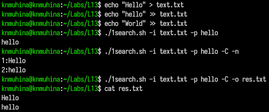
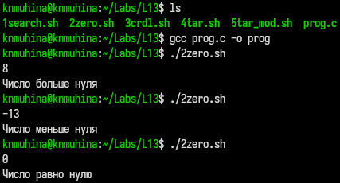
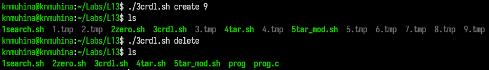
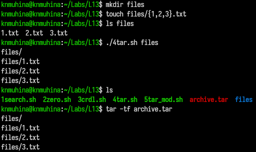
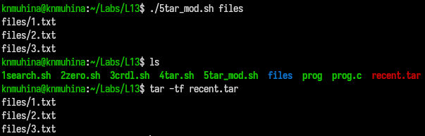

---
## Author
author:
  name: Мухина Ксения Николаевна
  email: 1032253531@rudn.ru
  affiliation:
    - name: Российский университет дружбы народов
      country: Российская Федерация
      postal-code: 115419
      city: Москва
      address: ул. Орджоникидзе, д. 3

## Title
title: "Отчёт по лабораторной работе №13"
subtitle: "Дисциплина: Операционные системы"
license: "CC BY-NC"
---

# Цель работы

Цель данной работы -- изучить основы программирования в оболочке ОС UNIX/Linux. Научится писать более сложные командные файлы с использованием логических управляющих конструкций и циклов.

# Задание

Этапы выполнения работы:

- работа со скриптами/командными файлами
	- скрипт анализа командной строки
	- скрипт сравнения числа с нулём
	- скрипт создания указанного числа файлов
	- скрипт создания архива файлов указанной директории
- ответы на контрольные вопросы

# Выполнение лабораторной работы

Для начала напишем скрипт анализа командной строки в соответствии с заданием.

```bash
#!/bin/bash

# значения по умолчанию
input=""
output=""
pattern=""
ignore_case=0
show_numbers=0

# разбор аргументов
while getopts "i:o:p:Cn" opt; do
  case $opt in
    i) input="$OPTARG" ;;
    o) output="$OPTARG" ;;
    p) pattern="$OPTARG" ;;
    C) ignore_case=1 ;;
    n) show_numbers=1 ;;
    *) echo "Неверный параметр"; exit 1 ;;
  esac
done

# проверка
if [ -z "$input" ] || [ -z "$pattern" ]; then
  echo "Нужно указать входной файл и шаблон"
  exit 1
fi

# формируем параметры grep
flags=""

[ $ignore_case -eq 1 ] && flags="$flags -i"
[ $show_numbers -eq 1 ] && flags="$flags -n"

# выполнение
if [ -z "$output" ]; then
  grep $flags "$pattern" "$input"
else
  grep $flags "$pattern" "$input" > "$output"
fi
```

Продемонстрируем работу скрипта.

{#01 width=70%}

Перейдём к скрипту сравнения числа с нулём.

Программа на C:

```bash
#include <stdio.h>
#include <stdlib.h>

int main() {
    int x;
    scanf("%d", &x);
    if (x > 0) exit(1);
    else if (x < 0) exit(2);
    else exit(0);
}
```

Скрипт вызова программы:

```bash
#!/bin/bash

./prog
res=$?

if [ $res -eq 1 ]; then
  echo "Число больше нуля"
elif [ $res -eq 2 ]; then
  echo "Число меньше нуля"
else
  echo "Число равно нулю"
fi
```

Продемонстрируем работу скрипта.

{#02 width=70%}

Далее - скрипт создания последовательных файлов от 1 до N.

```bash
#!/bin/bash

case $1 in
  create)
    N=$2
    for ((i=1; i<=N; i++))
    do
      touch "$i.tmp"
    done
    ;;
    
  delete)
    rm -f *.tmp
    ;;
    
  *)
    echo "Использование:"
    echo "$0 create N"
    echo "$0 delete"
    ;;
esac
```

Продемонстрируем работу скрипта.

{#03 width=70%}

Далее - создание архива файлов заданной директории.

```bash
#!/bin/bash

dir=$1
archive="archive.tar"

tar -cvf $archive "$dir"
```

Продемонстрируем работу скрипта.

{#04 width=70%}

Модифицируем скрипт.

```bash
#!/bin/bash

dir=$1
archive="recent.tar"

find "$dir" -type f -mtime -7 | tar -cvf $archive -T -
```

Продемонстрируем работу скрипта.

{#05 width=70%}

# Выводы

В результате проделанной работы мы изучили основы программирования в оболочке ОС UNIX/Linux; научились писать более сложные командные файлы с использованием логических управляющих конструкций и циклов.

# Контрольные вопросы

1. Каково предназначение команды getopts?

getopts позволяет разбирать аргументы командной строки (ключи типа -i, -o) внутри shell-скрипта.

2. Какое отношение метасимволы имеют к генерации имён файлов?

Метасимволы (*, ?, [ ]) используются для подстановки имён файлов.

Пример: *.txt — все .txt файлы.

3. Какие операторы управления действиями вы знаете?

- if, then, else

- case

- for

- while

- until

4. Какие операторы используются для прерывания цикла?

- break — полностью выйти из цикла.

- continue — перейти к следующей итерации.

5. Для чего нужны команды false и true?

Команды используются в условиях и циклах:

- true — всегда возвращает 0 (успех).

- false — всегда возвращает 1 (ошибка).

6. Что означает строка if test -f man$s/$i.$s, встреченная в командном файле?

Строка проверяет, существует ли файл man<s>/<i>.<s>, где $s и $i — переменные.

7. Объясните различия между конструкциями while и until.

Конструкция работает:

- while — пока условие истинно

- until — пока условие ложно

Пример:

- while [ $x -lt 5 ] — пока x < 5

- until [ $x -eq 5 ]  — пока x ≠ 5

# Список литературы{.unnumbered}

1. [Лабораторная работа №13, ТУИС РУДН](https://esystem.rudn.ru/mod/page/view.php?id=1358205)
