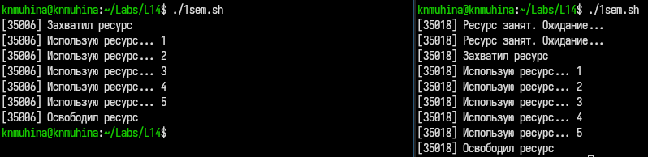
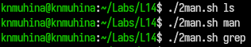
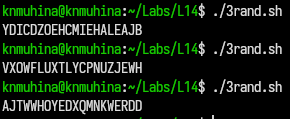

---
## Author
author:
  name: Мухина Ксения Николаевна
  email: 1032253531@rudn.ru
  affiliation:
    - name: Российский университет дружбы народов
      country: Российская Федерация
      postal-code: 115419
      city: Москва
      address: ул. Орджоникидзе, д. 3

## Title
title: "Отчёт по лабораторной работе №14"
subtitle: "Дисциплина: Операционные системы"
license: "CC BY-NC"
---

# Цель работы

Цель данной работы -- изучить основы программирования в оболочке ОС UNIX/Linux. Научится писать более сложные командные файлы с использованием логических управляющих конструкций и циклов.

# Задание

Этапы выполнения работы:

- работа со скриптами/командными файлами
	- скрипт упрощённого механизма семафоров
	- скрипт реализации команды man
	- скрипт генерации случайной последовательности латинских букв
- ответы на контрольные вопросы

# Выполнение лабораторной работы

Для начала напишем скрипт реализации упрощённого механизма семафоров в соответствии с заданием.

```bash
#!/bin/bash

LOCKFILE="/tmp/my_resource.lock"

WAIT_TIME=3
USE_TIME=5

PID=$$

while true
do
    if [ ! -f "$LOCKFILE" ]; then

        echo "$PID" > "$LOCKFILE"
        echo "[$PID] Захватил ресурс"

        for ((i=1; i<=USE_TIME; i++))
        do
            echo "[$PID] Использую ресурс... $i"
            sleep 1
        done

        rm -f "$LOCKFILE"
        echo "[$PID] Освободил ресурс"

        exit 0

    else

        echo "[$PID] Ресурс занят. Ожидание..."
        sleep "$WAIT_TIME"

    fi
done
```

Продемонстрируем работу скрипта.

{#01 width=70%}

Перейдём к скрипту реализации команды man.

```bash
#!/bin/bash

COMMAND=$1
MAN_DIR="/usr/share/man/man1"

FILE="$MAN_DIR/${COMMAND}.1.gz"

if [ -f "$FILE" ]; then
    zcat "$FILE" | less
else
    echo "Справка для команды '$COMMAND' не найдена"
fi
```

Продемонстрируем работу скрипта.

{#02 width=70%}

Далее - генерация случайной последовательности латинских букв.

```bash
#!/bin/bash

COUNT=20

for ((i=1; i<=COUNT; i++))
do
    NUM=$(( RANDOM % 26 + 65 ))

    printf "\\$(printf '%03o' "$NUM")"
done

echo
```

Продемонстрируем работу скрипта.

{#03 width=70%}

# Выводы

В результате проделанной работы мы изучили основы программирования в оболочке ОС UNIX/Linux; научились писать более сложные командные файлы с использованием логических управляющих конструкций и циклов.

# Контрольные вопросы

1. Найдите синтаксическую ошибку в следующей строке: while [$1 != "exit"]

Ошибка: отсутствуют пробелы вокруг `[` и `]`.

Правильно:

```bash
while [ "$1" != "exit" ]
```

2. Как объединить (конкатенация) несколько строк в одну?

Просто записать подряд:

```bash
str1="Hello"
str2="World"

result="$str1$str2"
```

или с пробелом:

```bash
result="$str1 $str2"
```

3. Найдите информацию об утилите seq. Какими иными способами можно реализовать её функционал при программировании на bash?

Команда `seq` генерирует числовую последовательность.

```bash
seq 1 5
```

Вывод:

```text
1
2
3
4
5
```

Аналоги в bash:

```bash
for ((i=1; i<=5; i++))
do
    echo $i
done
```

```bash
echo {1..5}
```

4. Какой результат даст вычисление выражения $((10/3))?

Результат:

```text
3
```

то есть целое от деления.

5. Укажите кратко основные отличия командной оболочки zsh от bash.

Преимущества zsh:

* более мощное автодополнение;
* исправление опечаток;
* удобная работа с шаблонами;
* больше возможностей кастомизации;
* поддержка тем и плагинов (например, `oh-my-zsh`).

Преимущества bash:

* установлен почти везде;
* выше совместимость со скриптами;
* стандарт де-факто для Linux.

6. Проверьте, верен ли синтаксис данной конструкции: for ((a=1; a <= LIMIT; a++))

Синтаксис неверный, потому что `LIMIT` должен быть переменной.

Правильно:

```bash
for ((a=1; a <= $LIMIT; a++))
```

7. Сравните язык bash с какими-либо языками программирования. Какие преимущества у bash по сравнению с ними? Какие недостатки?

Сравним с Python.

Преимущества bash:

* идеально подходит для администрирования;
* быстрый запуск без компиляции;
* легко работать с файлами и процессами;
* встроенные UNIX-команды.

Недостатки:

* неудобен для больших проектов;
* слабая типизация;
* сложнее отлаживать;
* ограниченные структуры данных;
* ниже читаемость сложных программ.

Преимущества Python:

* более читаемый код;
* много библиотек;
* ООП;
* удобная отладка.

# Список литературы{.unnumbered}

1. [Лабораторная работа №14, ТУИС РУДН](https://esystem.rudn.ru/mod/page/view.php?id=1358207)
