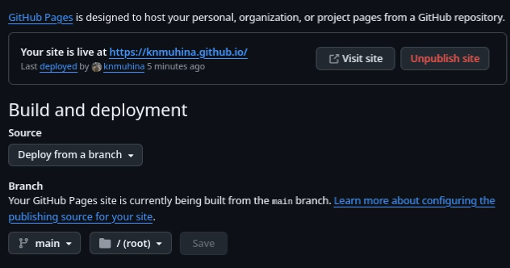

---
## Author
author:
  name: Мухина Ксения Николаевна
  email: 1032253531@rudn.ru
  affiliation:
    - name: Российский университет дружбы народов
      country: Российская Федерация
      postal-code: 115419
      city: Москва
      address: ул. Орджоникидзе, д. 3
## Title
title: "Отчёт по индивидуальному проекту №1"
licence: CC BY-NC
date: today
date-format: "YYYY-MM-DD" # Example: 2025-09-06
---

# Информация

## Докладчик

:::::::::::::: {.columns align=center}
::: {.column width="70%"}

  * Мухина Ксения Николаевна
  * студент 1 курса, бакалавриат
  * компьютерные и информационные науки
  * Российский университет дружбы народов им. П. Лумумбы
  * [1032253531@rudn.ru](mailto:1032253531@rudn.ru)
  * <https://github.com/knmuhina/>

:::
::: {.column width="30%"}

:::
::::::::::::::

# Вводная часть

## Актуальность

- Сайт научного сотрудника содержит полезную информацию о авторе, его публикациях, работах и иной деятельности 

## Объект и предмет исследования

- Заготовка сайта на GitHub Pages
- Программное обеспечение для создания сайта

## Цели и задачи

- Установить необходимое ПО
- Скачать шаблон темы сайта
- Разместить шаблон на GitHub
- Установить параметры для URLs сайта
- Разместить заготовки будущего сайта на GitHub Pages

# Выполнение работы

## Установка программного обеспечения

- Для начала необходимо установить следующее ПО:
- git
- node.js
- hugo

## Шаблон сайта

- Необходимо клонировать [шаблон сайта с репозитория](https://github.com/wowchemy/starter-hugo-academic) и загрузим его на сервер в репозиторий knmuhina.github.io
- Далее нужно изменить конфигурацию hugo.yaml, указав в качестве базового URL нашего будущего сайта
- Далее выполняется генерация сайта

## Настройка GitHub Pages и создание коммита

- В настройках GitHub Pages устанавливается ветка main и каталог '/'
- Далее создаётся коммит публикации сайта и изменения отправляются на сервер

{#01 width=70%}

# Результаты

## Результаты работы

- Были размещены заготовки будущего сайта на GitHub Pages
- По URL knmuhina.github.io расположен шаблон будущего сайта

{#02 width=70%}
