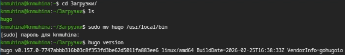
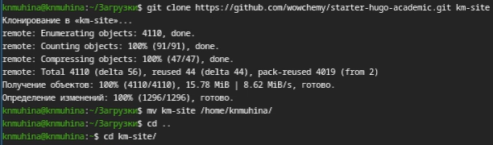
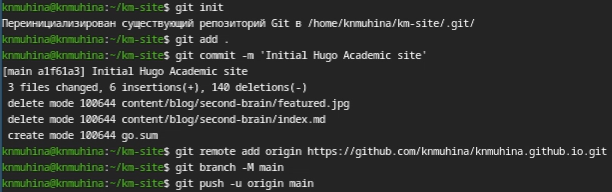
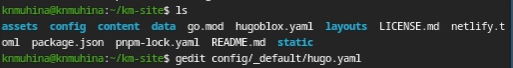
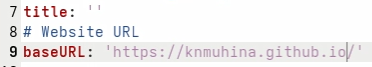
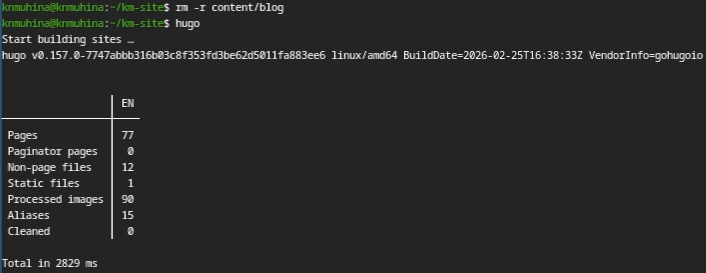
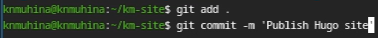
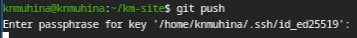

---
## Author
author:
  name: Мухина Ксения Николаевна
  email: 1032253531@rudn.ru
  affiliation:
    - name: Российский университет дружбы народов
      country: Российская Федерация
      postal-code: 115419
      city: Москва
      address: ул. Орджоникидзе, д. 3

## Title
title: "Отчёт по индивидуальному проекту №1"
subtitle: "Дисциплина: Операционные системы"
license: "CC BY-NC"
---

# Цель работы

Цель данной работы -- разместить заготовки будущего сайта на GitHub Pages.

# Задание

Этапы выполнения работы:

- Установка необходимого ПО
- Скачивание шаблона темы сайта
- Размещение на GitHub
- Установка параметра для URLs сайта
- Размещение заготовки сайта на GitHub Pages

# Выполнение лабораторной работы

Перед началом работы необходимо установить git, node.js и hugo. Так как git и node.js уже установлены, мы установим лишь hugo. Установка будет произведена вручную.

{#01 width=70%}

Далее клонируем [шаблон сайта с репозитория](https://github.com/wowchemy/starter-hugo-academic) и переместимся в папку с содержимым.

{#02 width=70%}

Загрузим это на сервер в репозиторий knmuhina.github.io.

{#03 width=70%}

Изменим конфигурацию hugo.yaml. Всё, что надо изменить - 'baseURL' на URL будущего сайта.

{#04 width=70%}

{#05 width=70%}

Далее необходимо выполнить генерацию сайта. Каталоги, содержащиеся в 'content/blog', необходимо удалить, так как из-за невозможности загрузить изображения с домена (по не зависящим от выполняющего работу причинам) генерация сайта прерывается. Удалим каталоги, мешающие генерации сайта, и выполним её корректно.

{#06 width=70%}

Далее настроим ветку в репозитории. Перейдём в 'Settings > GitHub Pages', поставим ветку main и каталог '/'.

{#07 width=70%}

Создадим коммит публикации сайта.

{#08 width=70%}

Отправим изменения на сервер.

{#09 width=70%}

Шаблон сайта готов и размещён на соответствующей странице.

{#10 width=70%}

# Выводы

В результате проделанной работы мы успешно разместили заготовки будущего сайта на GitHub Pages.
