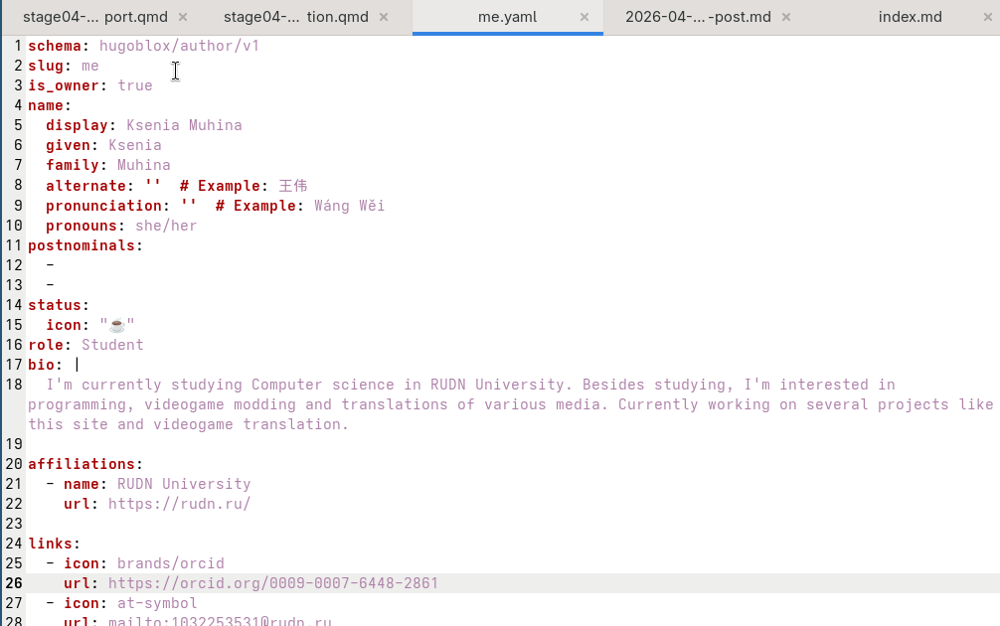
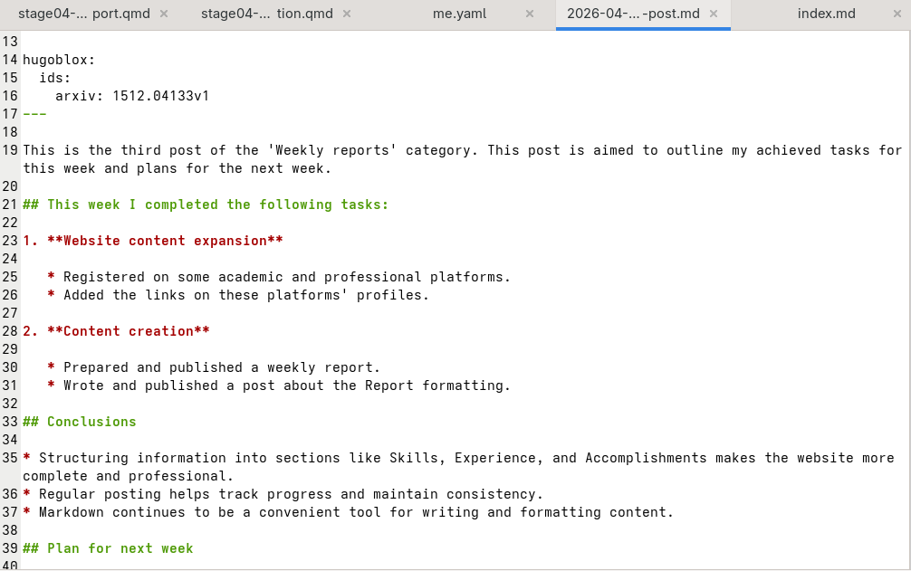
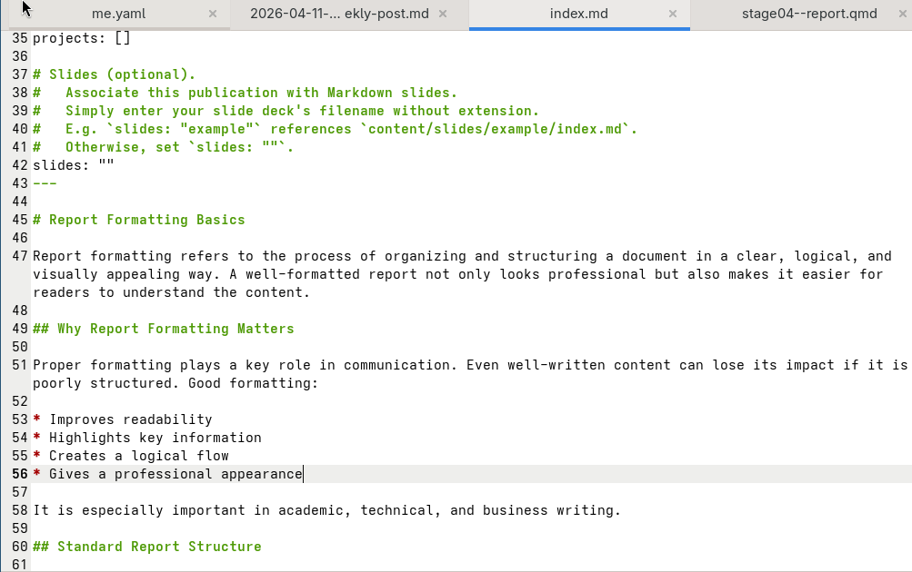
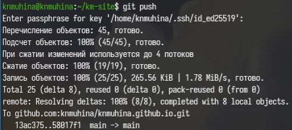

---
## Author
author:
  name: Мухина Ксения Николаевна
  email: 1032253531@rudn.ru
  affiliation:
    - name: Российский университет дружбы народов
      country: Российская Федерация
      postal-code: 115419
      city: Москва
      address: ул. Орджоникидзе, д. 3

## Title
title: "Отчёт по индивидуальному проекту №4"
subtitle: "Дисциплина: Операционные системы"
license: "CC BY-NC"
---

# Цель работы

Цель данной работы -- разместить ссылки на свои профили на научных и библиометрических ресурсах.

# Задание

Этапы выполнения работы:

- Добавление информации о себе
- Создание отчёта по прошедшей неделе
- Создание публикации о оформлении отчётов
- Размещение на GitHub

# Выполнение лабораторной работы

Для начала изменяем файл me.yaml, расположенный в каталоге data/authors, чтобы добавить информацию о себе.

{#01 width=70%}

Создаём отчёт по прошедшей неделе в соответствующем каталоге content/blog.

{#02 width=70%}

Далее создаём публикацию на тему "Оформление отчётов", добавляя соответствующий файл в каталог content/publications.

{#03 width=70%}

Загрузим все файлы на сервер.

{#04 width=70%}

# Выводы

В результате проделанной работы мы успешно разместили больше данных о себе и создали несколько публикаций.
